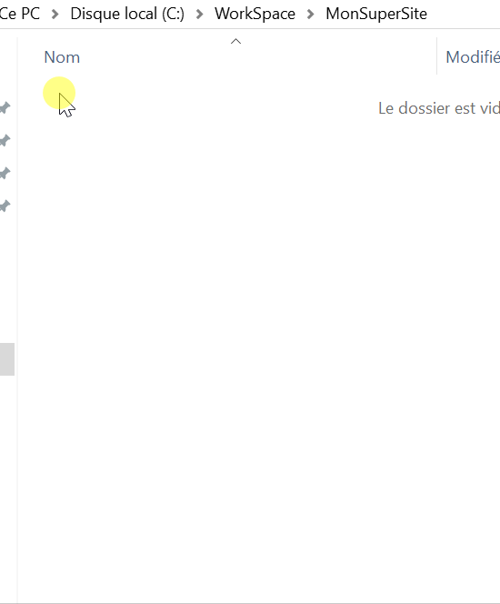

> *Prérequis* : [Visual Studio Code](/visual-studio-code) est installé sur votre poste

## Environnement de travail

Dans un endroit futé, créez un dossier, par exemple `MonSuperSite`.

> **Important**: Pour les noms de dossiers et de fichiers, ne pas utiliser d'espaces, de caractères spéciaux, des accents, et en HTML les noms de fichiers et de sous-dossiers sont en minuscule. Voir [Naming HTML Conventions](http://thenewcode.com/30/HTML-Naming-Conventions-and-File-Management)

Dans le dossier, un clic-droit et ouvrir avec VS code.

Ensuite, créez un nouveau fichier: `index.html`.


## La structure d'un fichier HTML

Chaque fichier .html commence à peu près avec le même code:

```html
<!DOCTYPE html>
```

Pourquoi est-ce important ?

Un navigateur a [différents modes de visualisation](https://developer.mozilla.org/en-US/docs/Web/HTML/Quirks_Mode_and_Standards_Mode) et dès que nous recevons les informations demandées, qui sont un fichier .html dans notre cas, nous voulons nous assurer que le navigateur de l’utilisateur est défini sur le mode standard. C’est en gros le mode que nous utilisons tout le temps, mais si le navigateur est configuré sur un mode spécial (mode «bizarreries» ou "quirks" mode), l’affichage correct d’une page Web risque de devenir difficile.

Par conséquent, `<!DOCTYPE html>` doit être défini correctement chaque fois que vous commencez à écrire votre code .html.

L'élément suivant requis est l'élément `<html>`:

``` html
<!DOCTYPE html>
<html>

</html>
```

Cet élément est vraiment important, car les balises d'ouverture `<html>` et de fermeture `</html>` enveloppent tout le code dans notre fichier .html. Autrement dit: tout le code HTML que vous écrivez doit être écrit entre ces deux balises.

## La balise head

Un nouvel élément: `<head>`

```html
<!DOCTYPE html>
<html>
   <head>

   </head>
</html>
```

Assurez-vous également de regarder l'indentation que nous avons créé. Comme indiqué précédemment, le code de l'ensemble du fichier est placé entre les balises `<html>`. Par conséquent, `<head>` doit être mis en retrait pour améliorer la lisibilité et refléter la structure de fichier précédemment expliquée.

L'élément `<head>` est très important, bien que son contenu ne soit en réalité pas visible sur le site Web. Comment cela peut-il être important alors? Il inclut des métadonnées - des informations sur votre application Web requises par le navigateur.

Ajoutons un élément `<meta>`:

```html
<!DOCTYPE html>
<html>
   <head>
      <meta>
   </head>
</html>
```

La première chose que vous remarquerez peut-être, c’est que cet élément est différent des autres éléments que nous avons créés jusqu’à présent. La balise de fermeture (par exemple </ html>) est manquante, car `<meta>` est un élément vide et ne nécessite donc pas une telle balise de fermeture. C’est juste une remarque, nous y reviendrons plus en détail tout au long de du cours. Voyons maintenant le contenu réel d’un tel élément `<meta>`.

Un exemple général serait celui-ci, l'encodage:

```html
<!DOCTYPE html>
<html>
   <head>
      <meta charset="UTF-8">
   </head>
</html>
```

Ce jeu de caractères ajoute le codage de caractères à notre code et garantit donc que le contenu, ainsi que les lettres, les chiffres et les symboles, peuvent être correctement affichés sur notre site Web.

> [UTF-8](https://www.w3schools.com/charsets/ref_html_utf8.asp) est un jeu de caractères très courant, donc l'ajout à notre code n'est pas la pire des idées.

En plus de l'élément `<meta>`, nous pourrions également ajouter un élément `<title>` à notre `<head>` et y ajouter du contenu, par exemple «Notre première page Web»:

```html
<!DOCTYPE html>
<html>
   <head>
      <meta charset="UTF-8">
      <title>Notre première page Web</title>
   </head>
</html>
```

Il suffit d'ouvrir le fichier index.html dans le navigateur pour voir l'effet !

C'était facile non? En ajoutant simplement l'élément `<title>`, nous avons ajouté ce texte sous le nom de notre onglet, ce qui est plutôt sympa. Et nous comprenons également pourquoi l'élément est ajouté dans le `<head>` et ne fait pas partie du contenu réel de la page (il ne s'agit que du nom de l'onglet, rien n'est affiché sur notre site Web jusqu'à présent).

Avec cela, nous avons également ajouté des éléments centraux à notre `<head>`. Bien sûr, nous pourrions ajouter des éléments supplémentaires, et nous le ferons également tout au long de ce cours, mais passons maintenant au contenu réel de notre site Web.
  
## La balise body
  
Tout comme `<head>` englobe tous les éléments qui incluent des méta-informations, `<body>` est l’élément enveloppant de tout le contenu de notre fichier .html:

```html
<!DOCTYPE html>
<html>
   <head>
      <meta charset="UTF-8">
      <title>Notre première page Web</title>
   </head>
   <body>

   </body>
</html>
```

Alors que nous ajoutons continuellement des éléments à notre code, sans vraiment comprendre ce que sont les éléments et leur fonctionnement, nous devrions plonger dans la théorie avant de continuer.

Généralement, nous pouvons distinguer les éléments **sémantiques** des éléments **non sémantiques** en HTML. Alors que les éléments sémantiques incluent des informations pour le navigateur - par exemple `<p>` indique que nous voulons ajouter un paragraphe à cette position - les éléments non sémantiques n'incluent pas ces informations supplémentaires. Par conséquent, ces derniers sont uniquement destinés à ajouter une structure supplémentaire au code au cas où les éléments sémantiques existants ne seraient pas suffisants.
  
Quelques exemples:

+ *Sémantiques* : p, h1, head, body, footer, ...
+ *Non sémantiques* : div, span, ...

> Assurez-vous de consulter le [MDN](https://developer.mozilla.org/en-US/docs/Web/HTML/Element) pour en savoir plus sur les différents éléments disponibles en HTML.

## Créer notre premier site Web

Commençons par le `<header>` . Comme expliqué dans la dernière section de cet article, nous allons ajouter cet élément uniquement pour la sémantique. Pour le contenu, nous devons ajouter un autre élément, par exemple `<h1>`:
  
```html
<!DOCTYPE html>
<html>
   <head>
      <meta charset="UTF-8">
      <title>Notre première page Web</title>
   </head>
   <body>
      <header>
         <h1>Le monde de Gerflor</h1>
      </header>
   </body>
</html>
```

> **Important:**
Bien que l'élément `<h1>` soit livré avec un style par défaut et spécial (taille de police en caractères gras et plus gros), le style de notre site Web ne doit pas être basé sur des éléments HTML. Pour ce faire, nous utiliserons CSS (Cascading Style Sheets).

Pour nous, l'élément `<h1>` nous aide simplement à identifier rapidement le titre actuel de notre code comme `<h1>`, `<h2>`,…, `<h6>` sont généralement utilisés pour indiquer les différents [titres](https://developer.mozilla.org/en-US/docs/Web/HTML/Element/Heading_Elements) d'un site Web.

La prochaine chose dont nous avons besoin est notre barre de navigation. En tant qu’éléments d’emballage, nous utiliserons `<nav>`, les éléments de navigation seront créés par une liste non ordonnée (`<ul>`). Une alternative serait une liste ordonnée (`<ol>`).

L’utilisation de `<ul>` ajoutera des puces à chaque élément, `<ol>` ordonnera les éléments de 1-x, c’est la différence principale.
  
L'utilisation de listes est assez courante pour créer de telles barres de navigation, nous allons donc suivre cette approche. Assurez-vous de placer chaque élément de la liste entre les balises d'ouverture `<li>` et de fermeture `</li>`.

Du point de vue du code, nous devrions être à l'état suivant maintenant:

```html
<!DOCTYPE html>
<html>
   <head>
      <meta charset="UTF-8">
      <title>Notre première page Web</title>
   </head>
   <body>
      <header>
         <h1>Le monde de Gerflor</h1>
      </header>
     <nav>
         <ul>
            <li>Accueil</li>
            <li>Contact</li>
         </ul>
     </nav>
   </body>
</html>
```

Il est temps de passer à autre chose et de créer la section `<main>`. Suivant notre structure précédemment appliquée, nous utiliserons `<main>` pour indiquer la section principale de notre site Web. Pour le contenu actuel, nous utiliserons quelques paragraphes:
  
```html
<!DOCTYPE html>
<html>
   <head>
      <meta charset="UTF-8">
      <title>Notre première page Web</title>
   </head>
   <body>
      <header>
         <h1>Le monde de Gerflor</h1>
      </header>
     <nav>
         <ul>
            <li>Accueil</li>
            <li>Contact</li>
         </ul>
     </nav>
     <main>
         <p>Mon voyage dans la Beauce</p>
         <p>Le meilleur camping du Havre</p>
         <p>Une photo d'un chat rigolo</p>
         <p>La vie des cailloux en milieu aquatique</p>
     </main>
   </body>
</html>
```

Ajouter le `<footer>` terminera le contenu réel de notre site Web. Le pied de page final contiendra à la fois des images et du texte.

```html
<!DOCTYPE html>
<html>
   <head>
      <meta charset="UTF-8">
      <title>Notre première page Web</title>
   </head>
   <body>
      <header>
         <h1>Le monde de Gerflor</h1>
      </header>
     <nav>
         <ul>
            <li>Accueil</li>
            <li>Contact</li>
         </ul>
     </nav>
     <main>
         <p>Mon voyage dans la Beauce</p>
         <p>Le meilleur camping du Havre</p>
         <p>Une photo d'un chat rigolo</p>
         <p>La vie des cailloux en milieu aquatique</p>
     </main>
     <footer>
         <p>Image1 - Quelle belle image !</p>
         <p>Image2 - Bof...</p>
      </footer>
   </body>
</html>
```

Avec cela, le contenu de base est terminé et, même si le site Web contient encore des espaces réservés et est loin d’être terminé, les éléments de base sont définis.

[Continuer vers la partie 2: Insérer des images et des liens](/demarrer-en-html-partie-2)
