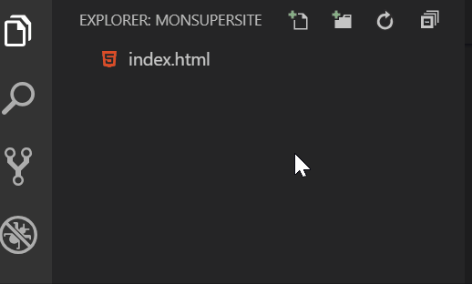

> *Prérequis* : Avoir lu la [partie 1](/demarrer-en-html-partie-1)

## Ajouter une image

Il y a en gros deux façons d'ajouter une image: soit à partir d'un fichier, soit à partir d'un lien.

### Image à partir d'un lien

On peut chercher des images d'un peu tout et n'importe quoi sur Google.

Pour l'exemple cherchons une image de chat rigolo. 

> **Important:** Si c'est pour un site qui a vocation à être publié, il faut faire très très très très attention aux droits d'auteur !!!

Quand vous trouvez une image qui vous intéresse, il vous suffit de copier l'adresse de l'image avec un clic-droit, puis:

```html

```

Dans le fichier complet, ça donne:

```html
<!DOCTYPE html>
<html>
   <head>
      <meta charset="UTF-8">
      <title>Notre première page Web</title>
   </head>
   <body>
      <header>
         <h1>Le monde de Gerflor</h1>
      </header>
     <nav>
         <ul>
            <li>Accueil</li>
            <li>Contact</li>
         </ul>
     </nav>
     <main>
         <p>Mon voyage dans la Beauce</p>
         <p>Le meilleur camping du Havre</p>
         <p>Une photo d'un chat rigolo 
       </p>
         <p>La vie des cailloux en milieu aquatique</p>
     </main>
     <footer>
         <p>Image1 - Quelle belle image !</p>
         <p>Image2 - Bof...</p>
      </footer>
   </body>
</html>
```

Cette méthode est valable si vous avez des images stockées dans le cloud, comme avec Google Drive, Dropbox, Onedrive ou autre.

Au passage: vous pouvez essayer le site [cloudinary](https://cloudinary.com/) qui permet le partage avancé de photos.

### Image à partir d'un fichier

Nous devons en premier créer un sous-dossier, par exemple `img`, dans lequel nous allons stocker nos images.



Pour simplifier, nous allons mettre une image dans ce dossier que nous allons renommer `image1.jpg`

Pour l'insérer dans notre site:

```html

```

> Pratique: l'auto-complétion des chemins pour insérer une image par exemple:


> `./img/image1.jpg` est un chemin **relatif**. Tous les chemins doivent être relatifs, pas *absolus*.
Il faut de plus respecter la *casse*, c'est-à-dire les majuscules et les minuscules.

Vous pouvez mettre cette image à l'endroit que vous souhaitez. Faites plusieurs essais 😸

## Ajouter des pages

Un site est souvent composé de plusieurs pages. Nous allons ajouter une page "Contact".

Pour ce faire, nous allons créer un sous-dossier `contact` dans lequel nous allons créer un fichier `index.html`


> Le fichier peut être appelé différemment (pas encore index.html), mais la plupart des serveurs Web serviront généralement les fichiers index.html si le navigateur visite simplement un dossier (par exemple, mon-url.com/contacts - la plupart des serveurs essaieraient de retourner un fichier index.html).

Suivre cette approche n’est donc pas la pire des idées. Généralement, pour créer la structure de votre site Web, vous devez donc créer un nouveau dossier en fonction des différentes pages de votre site, comme «Contact» dans notre exemple. Chaque dossier contenant un fichier index.html n’est pas une mauvaise pratique.

En copiant les premières lignes de notre fichier index.html principal jusqu’à `</ nav>` et en ajoutant les balises `</ body>` et `</ html>`, créons rapidement le contenu de cette page. Nous n’ajouterons aucune information supplémentaire à ce stade. La nouvelle page est donc créée - mission terminée.

## Ajouter des liens

Pour ajouter des liens nous utilisons la balise `<a></a>`, par exemple:

```html
<a href="contact/index.html">Contact</a>
```

Notre fichier principal devrait alors ressembler à:

```html
<!DOCTYPE html>
<html>
   <head>
      <meta charset="UTF-8">
      <title>Notre première page Web</title>
   </head>
   <body>
      <header>
         <h1>Le monde de Gerflor</h1>
      </header>
     <nav>
         <ul>
            <li>Accueil</li>
            <li><a href="contact/index.html">Contact</a></li>
         </ul>
     </nav>
     <main>
         <p>Mon voyage dans la Beauce</p>
         <p>Le meilleur camping du Havre</p>
         <p>Une photo d'un chat rigolo 
       </p>
         <p>La vie des cailloux en milieu aquatique</p> 
     </main>
     <footer>
         <p>Image1 - Quelle belle image !</p>
         
         <p>Image2 - Bof...</p>
      </footer>
   </body>
</html>
```

Dans notre page de contact, nous allons faire un lien vers la page principale:

```html
<!DOCTYPE html>
<html>
   <head>
      <meta charset="UTF-8">
      <title>Notre page de contact</title>
   </head>
   <body>
      <header>
         <h1>Le monde de Gerflor</h1>
      </header>
     <nav>
         <ul>
            <li><a href="../index.html">Accueil</a></li>
           <li>Contact</li>
         </ul>
     </nav>
   </body>
</html>
```

Nous pouvons de la même façon créer des liens vers un site existant, par exemple:

```html
<a href="https://acadetex-snt.netlify.com/">AcadeTex</a>
```

## Petites explications sur les chemins relatifs

Nous avons utilisé:

```html
<a href="../index.html">
```

Dans `../index.html` les deux points du début signifient que l'on remonte dans l'arborescence du site.

En fait nous n'avons pas vraiment besoin de préciser `index.html`. Un simple `../` suffirait.

> Pour en savoir plus: [HTML File Paths](https://www.w3schools.com/html/html_filepaths.asp)
