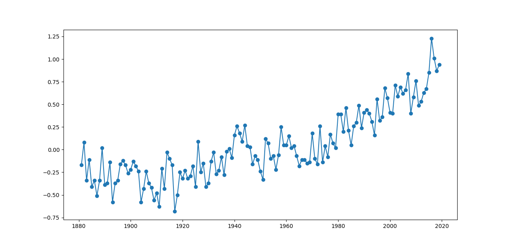
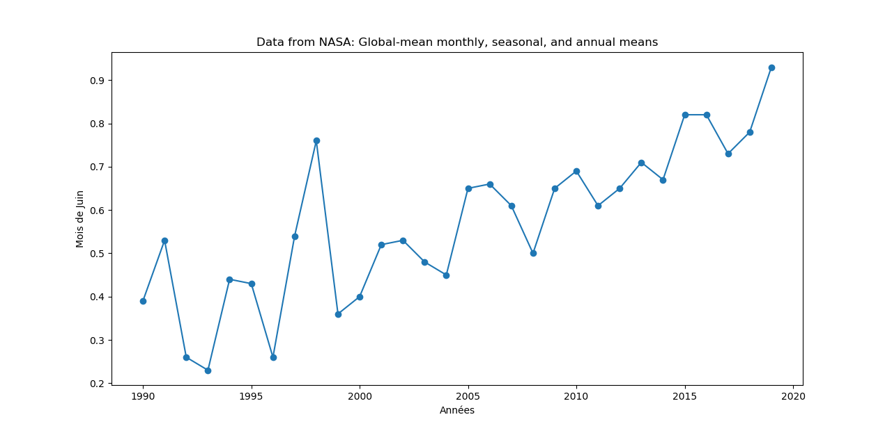
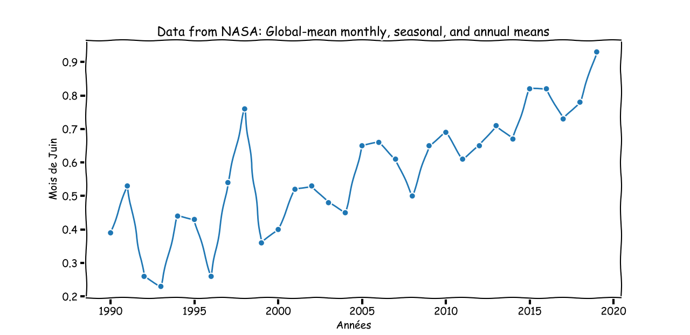

# Python matplotlib et visualisation de datas (.csv)

## Environnement de travail

- Python 3 doit être installé: [https://www.python.org/downloads/](https://www.python.org/downloads/)
- matplotlib doit être installé. Dans une invite `cmd` avec privilèges administrateur:
```bash
pip install matplotlib
```
- On va utiliser [Visual Studio Code](https://code.visualstudio.com/)

## Récupérer un fichier .csv

Le format `csv`est utilisé pour le data. Il peut être obtenu par export d'un fichier Excel, ou récupéré sur des sites Internet. Pour en savoir plus: [https://fr.wikipedia.org/wiki/Comma-separated_values](https://fr.wikipedia.org/wiki/Comma-separated_values)

Pour l'exemple, nous allons nous servir d'un fichier de températures récupéré sur le site de la NASA (tant qu'à faire !!!)

Lien vers le site: [https://data.giss.nasa.gov/gistemp/](https://data.giss.nasa.gov/gistemp/)

Nous allons prendre le fichier correspondant au `Global-mean monthly, seasonal, and annual means`.

Lien de téléchargement direct: [https://data.giss.nasa.gov/gistemp/tabledata_v4/GLB.Ts+dSST.csv](https://data.giss.nasa.gov/gistemp/tabledata_v4/GLB.Ts+dSST.csv)

Si tout va bien, vous récupérez le fichier `GLB.Ts+dSST.csv`

+ Créer un dossier de travail. Par exemple `matplotlib_csv`
+ Copier le fichier `GLB.Ts+dSST.csv`
+ Ouvrir le dossier avec `Visual Studio Code`
+ Ouvrir le fichier `GLB.Ts+dSST.csv`

Vous devez obtenir quelque chose qui ressemble à ça:

```bash
Land-Ocean: Global Means
Year,Jan,Feb,Mar,Apr,May,Jun,Jul,Aug,Sep,Oct,Nov,Dec,J-D,D-N,DJF,MAM,JJA,SON
1880,-.18,-.24,-.09,-.16,-.10,-.21,-.18,-.10,-.15,-.24,-.22,-.18,-.17,***,***,-.12,-.16,-.20
... 
```

Il faut supprimer la ligne de titre (ne pas laisser la ligne vide, vraiment la supprimer !), puis enregistrer (`CTRL+S`)

```bash
Year,Jan,Feb,Mar,Apr,May,Jun,Jul,Aug,Sep,Oct,Nov,Dec,J-D,D-N,DJF,MAM,JJA,SON
1880,-.18,-.24,-.09,-.16,-.10,-.21,-.18,-.10,-.15,-.24,-.22,-.18,-.17,***,***,-.12,-.16,-.20
... 
```

:::tip Remarque
On pourrait bien sûr automatiser la suppression de la ligne de titre avec Python, mais on va faire simple dans cet article...
:::

## Parser des .csv avec Python

Dans le dossier, créer un fichier Python, par exemple `matplotlib_csv.py`

Dans ce fichier, copier-coller le code suivant:

```python
import csv

with open('GLB.Ts+dSST.csv') as csv_file:
    csv_reader = csv.DictReader(csv_file)
    line_count = 0
    for row in csv_reader:
        if line_count == 0:
            print(f'Noms de colonnes: {", ".join(row)}')
            line_count += 1
        else:
            print(row['Year'], row['DJF'])
            line_count += 1
    print(f'Processed {line_count} lines.')
```

En gros: le fichier csv est converti en dictionnaire, dont les clés sont les en-têtes de colonnes.

On accède à une donnée dans une ligne avec `row['nom de la colonne']`.

Par exemple pour le mois de janvier: `row['Jan']`

:::tip Remarque
Sur le site de la NASA, on peut lire:

```bash
GLOBAL Land-Ocean Temperature Index in 0.01 degrees Celsius   
base period: 1951-1980

    sources:  GHCN-v4 1880-08/2019 + SST: ERSST v5 1880-08/2019
    using elimination of outliers and homogeneity adjustment
    Notes: 1950 DJF = Dec 1949 - Feb 1950 ;  ***** = missing
```
:::

## Graphique avec matplotlib

Si on veut visualiser les données, voici le code à entrer:

```python
import csv
import matplotlib.pyplot as plt

x=[]
y=[]

with open('GLB.Ts+dSST.csv') as csv_file:
    csv_reader = csv.DictReader(csv_file)
    line_count = 0
    for row in csv_reader:
        if line_count == 0:
            print(f'Column names are {", ".join(row)}')
            line_count += 1
        else:
            x.append(int(row['Year']))
            y.append(float(row['DJF']))
            line_count += 1
    print(f'Processed {line_count} lines.')
plt.plot(x,y, marker='o')
plt.title('Data from NASA: Global-mean monthly, seasonal, and annual means')
plt.xlabel('Années')
plt.ylabel('DJF')
plt.show()    
```

On remarquera la transformation en `int` des années, et en `float` dans variations. En effet, les données parsées sont des `str` à la base, qu'il faut donc convertir en nombres pour les afficher !

Ca doit donner:



On pourrait vouloir un graphique avec les données du mois de juin, uniquement sur les 30 dernières années.

```python
import csv
import matplotlib.pyplot as plt

x=[]
y=[]

with open('GLB.Ts+dSST.csv') as csv_file:
    csv_reader = csv.DictReader(csv_file)
    line_count = 0
    for row in csv_reader:
        if line_count == 0:
            print(f'Column names are {", ".join(row)}')
            line_count += 1
        else:
            x.append(int(row['Year']))
            y.append(float(row['Jun']))
            line_count += 1
    print(f'Processed {line_count} lines.')

plt.plot(x[-30:],y[-30:], marker='o')
plt.title('Data from NASA: Global-mean monthly, seasonal, and annual means')
plt.xlabel('Années')
plt.ylabel('Mois de Juin')

plt.show()  
```



## Un peu de fun dans matplotlib

En regardant la page d'exemples de matplotlib, on peut trouver des trucs sympas:

[https://matplotlib.org/3.1.1/tutorials/introductory/sample_plots.html](https://matplotlib.org/3.1.1/tutorials/introductory/sample_plots.html)

```python
import csv
import matplotlib.pyplot as plt

x=[]
y=[]

with open('GLB.Ts+dSST.csv') as csv_file:
    csv_reader = csv.DictReader(csv_file)
    line_count = 0
    for row in csv_reader:
        if line_count == 0:
            print(f'Column names are {", ".join(row)}')
            line_count += 1
        else:
            x.append(int(row['Year']))
            y.append(float(row['Jun']))
            line_count += 1
    print(f'Processed {line_count} lines.')

with plt.xkcd():
    # Based on "Stove Ownership" from XKCD by Randall Munroe
    # https://xkcd.com/418/
    plt.plot(x[-30:],y[-30:], marker='o')
    plt.title('Data from NASA: Global-mean monthly, seasonal, and annual means')
    plt.xlabel('Années')
    plt.ylabel('Mois de Juin')

plt.show()  
```

