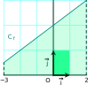
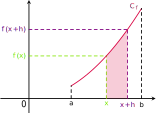
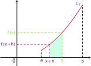
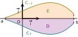
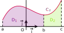
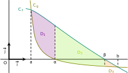
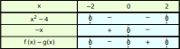
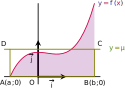

## Unité d'aire

::: warning Définition 
Soit $(O\,; \overrightarrow{i}, \overrightarrow{j})$ un repère orthogonal du plan.

On note $I$ et $J$ les points tels que $\overrightarrow{OI} = \overrightarrow{i}$ et $\overrightarrow{OJ} = \overrightarrow{j}$.
L'unité d'aire, que l'on note u.a., est l'aire du rectangle dont $O$, $I$ et $J$ forment trois sommets.

:::

## Intégrale d'une fonction continue et positive

::: warning Définition [Notion d'intégrale]
Soit $f$ une fonction continue et positive sur un intervalle $[a\,;b]$ de courbe représentative $\mathcal{C}_f$ dans un repère orthogonal $(O\,; \overrightarrow{i}, \overrightarrow{j})$.
L'intégrale de $a$ à $b$ de $f$ est l'aire, exprimée en unités d'aire, du domaine situé entre la courbe $\mathcal{C}_f$, l'axe des abscisses et les droites d'équation $x=a$ et $x=b$.

Cette aire se note ${\int_{a}^{b}}f(x)\,\mathrm{d}x$ et on prononce  «  intégrale (ou somme) de $a$ à $b$ de $f(x)\,\mathrm{d}x$  » .
:::

::: tip Remarques 

+  $a$ et $b$ s'appellent respectivement  «  borne inférieure  »  et  «  borne supérieure  »  de l'intégrale.

+  La valeur de l'intégrale ne dépend que de $a$, $b$ et $f$ ; la variable $x$ n'intervenant pas dans le résultat, on dit qu'elle est muette et l'on peut donc noter indifféremment :
 $$\int_{a}^{b}f(x)\,\mathrm{d}x = \int_{a}^{b}f(t)\,\mathrm{d}t = \int_{a}^{b}f(u)\,\mathrm{d}u = \ldots$$ 

+  Pour toute fonction $f$ continue et positive en un réel $a$, ${\int_{a}^{a}}f(x)\,\mathrm{d}x = 0$ puisqu'il s'agit de l'aire d'un segment de hauteur $f(a)$.

+  Le symbole ${\int}$ est dû à G. W. Leibniz, (1646-1716). Il ressemble à un  «  s  »  allongé, rappelant que l'aire peut être calculée comme la somme de petites aires élémentaires.

:::

::: tip Exemple 
Soit $f : x \mapsto \dfrac{x}{2} + 2$ définie sur $[-3\,; 2]$.

Le domaine colorié est un trapèze dont l'aire est :
 $$\int_{-3}^{2}f(x)\,\mathrm{d}x = \dfrac{0,5+3}{2} \times 5 = 8,75 \text{ u.a.}$$ 
Les unités graphiques étant 0,6 cm pour l'axe des abscisses et 1 cm  pour l'axe des ordonnées, 1 u.a. représente 0,6 cm$^2$ et donc l'aire coloriée représente 5,25 cm$^2$.

:::

::: tip Exemple 
Soit $f : x \mapsto 1$ définie sur $[a\,; b]$.

Le domaine colorié est un rectangle de longueur $b-a$ et de largeur1. Ainsi :
 $$ \int_{a}^{b}\mathrm{d}x = b-a \text{ u.a.}$$

:::

::: warning Théorème [Dérivabilité d'une fonction définie par une intégrale]
Soit $f$ une fonction continue et positive sur un intervalle $[a\,;b]$.
La fonction $F : x \mapsto {\int_{a}^{x}}f(t)\,\mathrm{d}t$ est définie et dérivable sur $[a\,;b]$ et on a $F' = f$.
:::

::: tip Preuve 
On démontre ici cette propriété dans le cas d'une fonction $f$ croissante.
Pour tout $x \in [a\,;b]$, $F(x)$ existe bien puisqu'il s'agit de l'aire du domaine compris entre $\mathcal{C}_f$ et l'axe des abscisses, sur l'intervalle $[a\,;x]$.
Démontrons maintenant que $F$ est dérivable sur $[a\,;b]$. On considère alors, pour tous $x \in [a\,;b]$ et $h \neq 0$ tel que $x+h \in [a\,;b]$ :
 $$ 
\dfrac{\Delta F}{\Delta x}(x) = \dfrac{F(x+h) - F(x)}{h}.
 $$ 
Si $h > 0$ (voir schéma de gauche ci-dessous), $F(x+h) - F(x)$
représente l'aire du domaine compris entre $\mathcal{C}_f$ et l'axe
des abscisses, sur $[x\,;x+h]$. $f$ étant croissante, cette aire est
comprise entre celles des rectangles de largeur $h$ et de hauteurs
respectives $f(x)$ et $f(x+h)$ :
 $$ 
f(x)h \leqslant F(x+h) - F(x) \leqslant f(x+h)h
\quad
\iff
\quad
f(x) \leqslant \dfrac{\Delta F}{\Delta x}(x) \leqslant f(x+h).
 $$ 
Si $h < 0$ (voir schéma de droite ci-dessous), $F(x) - F(x+h)$
représente l'aire du domaine compris entre $\mathcal{C}_f$ et l'axe
des abscisses, sur $[x+h\,;x]$. $f$ étant croissante, cette aire est
comprise entre celles des rectangles de largeur $-h$ et de hauteurs
respectives $f(x+h)$ et $f(x)$ :
 $$ 
f(x+h)(-h) \leqslant F(x) - F(x+h) \leqslant f(x)(-h)
\quad
\iff
\quad
f(x+h) \leqslant \dfrac{\Delta F}{\Delta x}(x) \leqslant f(x).
 $$ 

$f$ étant une fonction continue, $\displaystyle\lim_{h \to 0} f(x+h) = f(x)$ et dans les deux cas, d'après le théorème des gendarmes , on conclut que $\displaystyle\lim_{h \to 0} \dfrac{\Delta F}{\Delta x}(x) = f(x)$.

:::

## Primitives d'une fonction continue

::: warning Définition 
Soit $f$ une fonction définie et continue sur un intervalle $I$.

Une primitive de $f$ sur $I$ est une fonction $F$ définie et dérivable sur $I$ telle que $F'=f$.
:::

::: tip Remarque 
On dit que $F$ est *une* primitive de $f$ et non pas *la* primitive de $f$ car une fonction admettant une primitive n'en admet pas une seule, comme le montre l'exemple ci-dessous.
:::

::: tip Exemple 
Soit $f : x \mapsto 2x$ définie sur $\mathbb{R}$. Alors
$F_1 : x \mapsto x^2$ est une primitive de $f$ sur
$\mathbb{R}$. De même, $F_2 : x \mapsto x^2 + 1$ est aussi
une primitive de $f$ sur $\mathbb{R}$. On a $F_1' = F_2' = f$.
:::

::: warning Théorème [Existence de primitives]
Toute fonction continue sur un intervalle $I$ admet des primitives sur $I$.
:::

::: tip Preuve 
On démontre ce théorème dans le cas où $I$ est un intervalle fermé $[a\,;b]$ et on admettra pour cela le résultat suivant :  «  toute fonction continue sur un intervalle $[a\,;b]$ est bornée et atteint ses bornes  » .

Soit $f$ une fonction continue sur $I$ et notons $m$ son minimum. La fonction $\varphi :  x \mapsto f(x) - m$ est alors continue et positive sur $I$. D'après le théorème précédent, la fonction $\Phi : x \mapsto {\int_a^x} \varphi(t)\,\mathrm{d}t$ est définie et dérivable sur $I$ et on a, pour tout $x \in I$ : $\Phi'(x) = \varphi(x) = f(x) - m$.

Étant donné que l'on cherche une fonction $F$, définie et dérivable sur $I$ telle que $F' = f$, la fonction $F : x \mapsto \Phi(x) + mx$ est une candidate idéale : elle est définie et dérivable sur $I$ et pour tout $x \in  I$, $F'(x) = \Phi'(x) + m = f(x)$.
:::

::: warning Théorème [Lien entre les primitives]
Soit $f$ une fonction définie et continue sur un intervalle $I$ et $F$ une primitive de $f$ sur $I$.

Alors $f$ admet une infinité de primitives sur $I$ qui sont toutes de la forme

$$x \mapsto F(x) + k, \quad k \in \mathbb{R}.$$
:::

::: tip Preuve 

+  Démontrons d'abord que toutes les primitives ont bien la forme
annoncée. Soit $G$ une primitive de $f$ sur $I$. Alors $G'=f=F'$ et
donc $G'-F'=0$.

La fonction $G-F$, de dérivée nulle, est donc une fonction
constante sur $I$ : il existe alors un réel $k$ tel que, pour tout
$x \in I$, $G(x)-F(x) = k$, soit $G(x) = F(x) + k$.

+  Vérifions maintenant que toutes les fonctions de la forme $x \mapsto F(x) + k$, avec $k$ réel, sont bien des primitives de $f$. Soit $k \in \mathbb{R}$ et $G : x \mapsto F(x) + k$ définie sur $I$. Alors $G$ est dérivable sur $I$ et pour tout $x \in  I$, $G'(x) = F'(x) = f(x)$ : $G$ est donc bien une primitive de $f$ sur $I$.

:::

::: warning Propriété [Condition d'unicité de la primitive]
Soient $x_0 \in I$ et $y_0$ deux réels donnés. Parmi toutes les primitives d'une fonction $f$ définie et continue sur $I$, il en existe une seule qui vérifie la condition $F(x_0) = y_0$.
:::

::: tip Preuve 

+  **Existence :** soit $G$ une primitive de $f$ sur $I$ et considérons $F : x \mapsto G(x) - G(x_0) + y_0$, définie sur $I$. Alors $F$ est aussi une primitive de $f$ sur $I$ et de plus, $F(x_0) = y_0$.

+  **Unicité :** notons $F$ et $G$ deux primitives de $f$ sur $I$ telles que $F(x_0) = G(x_0) = y_0$ et démontrons que $F(x) = G(x)$ pour tout $x \in I$. Comme $F$ et $G$ sont deux primitives de $f$, il existe, d'après le théorème précédent, un réel $k$ tel que, pour tout $x \in  I$, $F(x) = G(x) + k$. En particulier, pour $x=x_0$, on obtient $k=0$ et par conséquent $F=G$ sur $I$.

:::

::: tip Remarque 
Pour tout $x_0 \in I$, $F : x \mapsto {\int_{x_0}^x} f(t)\,\mathrm{d}t$ est donc *la*} primitive de $f$ sur $I$ s'annulant en $x_0$. En effet, $F$ est bien une primitive de $f$ sur $I$ et c'est la seule vérifiant la condition $F(x_0)=0$ .
:::

::: tip Méthode [Utiliser les propriétés élémentaires des primitives
]

**Exercice:**

Soient $\varphi$ et $\psi$ les fonctions définies sur $[1\,;+\infty[$ par :
 $$ 
\varphi(x) = \int_1^x t^2\,\mathrm{d}t \quad \text{et} \quad \psi(x) = \dfrac{x^3}{3}.
 $$ 

a)  Démontrer que $\varphi$ et $\psi$ sont deux primitives sur $[1\,;+\infty[$ d'une même fonction $f$ que l'on précisera.

b)  En déduire la relation qu'il existe entre $\varphi$ et $\psi$.

1.  Déterminer la primitive $F$ de $f$ telle que $F(1) = 3$.

**Correction**

a)  $f : t \mapsto t^2$ est continue et positive sur $[1\,;+\infty[$ donc d'après le théorème p.** texte à modifier**, $\varphi$ est définie et dérivable sur $[1\,;+\infty[$ et on a $\varphi' = f$. De plus, pour tout $x \geqslant 1$, $\psi'(x) = x^2$.

b)  $\psi$ est une primitive de $f$ sur $[1\,;+\infty[$ donc $\varphi$ est de la forme $\varphi(x) = \psi(x) + k$, $k \in \mathbb{R}$ pour tout $x \geqslant 1$. En particulier, $\varphi(1) = \psi(1) + k$ et donc $0 = \dfrac{1}{3} + k$, c'est-à-dire $k = -\dfrac{1}{3}$. On en déduit alors que pour tout $x \geqslant 1$, $\varphi(x) = \psi(x) - \dfrac{1}{3}$.

1.  Les primitives de $f$ sur $[1\,;+\infty[$ sont donc de la forme $F : x \mapsto \dfrac{x^3}{3} + k$, $k \in \mathbb{R}$.
   
$F(1) = 3$ donc $\dfrac{1}{3}+k=3$ donc $k = \dfrac{8}{3}$ et ainsi
$F(x) = \dfrac{x^3+8}{3}$ pour tout réel $x\geqslant 1$.

:::

::: warning Propriété [Calcul pratique d'une intégrale]
Soit $f$ une fonction continue et positive sur $[a\,;b]$ et $F$ une primitive de $f$ sur $[a\,;b]$. Alors :
 $$ \int_{a}^{b}f(x)\,\mathrm{d}x = F(b) - F(a) \quad \text{que l'on note aussi} \quad \left[ F(x) \right]_a^b. $$ 
:::

::: tip Preuve 
Introduisons la fonction $\Phi : x \mapsto {\int_{a}^x} f(t)\,\mathrm{d}t$ de sorte que ${\int_{a}^b} f(t)\,\mathrm{d}t = \Phi(b)$.

$\Phi$ et $F$ étant deux primitives de $f$ sur $[a\,;b]$, on en déduit d'après le théorème précédent qu'il existe un réel $k$ tel que $\Phi(x) = F(x) + k$ pour tout $x \in [a\,;b]$.\\
Ainsi, $\Phi(b) = F(b) + k$. Il nous reste à calculer $k$ : en remarquant que $\Phi(a) = 0$, il vient que $F(a) = -k$ et ainsi, $\Phi(b) = F(b) - F(a)$.
:::

::: tip Exemple 
On souhaite calculer ${\int_0^1} x^2\,\mathrm{d}x$. Pour
cela, posons $f : x \mapsto x^2$, définie sur $[0\,;1]$.

En remarquant que $F : x \mapsto \dfrac{x^3}{3}$ est une primitive de
$f$ sur $[0\,;1]$, on obtient :
 $$ 
\int_0^1 x^2\,\mathrm{d}x = \left[ \dfrac{x^3}{3} \right]_0^1
= \dfrac{1^3}{3} - \dfrac{0^3}{3} = \dfrac{1}{3}.
 $$ 

:::

::: warning Propriété [Primitives des fonctions usuelles]

|  Fonction $f$ définie par  | Une primitive $F$ définie par | Domaine de validité |
|---|---|---|
| $f(x) = k,\ k \in \mathbb{R}$  | $F(x) = kx$  |$\mathbb{R}$
| $f(x) = x^n, n \in  \mathbb{N}$ | $F(x) = \dfrac{1}{n+1}x^{n+1}$ |$\mathbb{R}$
|  $f(x) = \dfrac{1}{x^n}, n \in \mathbb{N}, n \geqslant 2$| $F(x) = -\,\dfrac{1}{n-1}\dfrac{1}{x^{n-1}}$ |$]-\infty\,;0[$ ou $]0\,; +\infty[$
|  $f(x) = \dfrac{1}{x}$  | $F(x) = \ln(x)$ |$]0\,; +\infty[$
|  $f(x)=\dfrac{1}{\sqrt{x}}$ | $F(x) = 2\sqrt{x}$ |$]0\,; +\infty[$
|  $f(x) = \text{e}^{x}$ | $F(x) = \text{e}^{x}$ |$\mathbb{R}$
|  $f(x) = \cos (x)$ | $F(x) = \sin(x)$ |$\mathbb{R}$
| $f(x) = \sin (x)$ | $F(x) = - \cos(x)$ |$\mathbb{R}$

:::

::: tip Méthode [Déterminer des primitives simples sur un intervalle donné
]

1.  Commencer par identifier le type de la fonction $f$ ainsi que le type de primitive.

2.  Dériver ce type de primitive.

3.  Ajuster les coefficients, en fonction du résultat précédent puis écrire les primitives.

**Exercice:**

Déterminer les primitives de chacune des fonctions suivantes sur l'intervalle donné.

1.  $f(x) = x^2$ sur $\mathbb{R}$ 

2.  $g(x) = \dfrac{6}{x^3}$ sur $]-\infty\,; 0[$

3.  $h(x) = \dfrac{1}{2x}$ sur $]0\,;+\infty[$ 

**Correction**

1.  $f$ est une fonction de degré 2, continue sur $\mathbb{R}$, une primitive sera donc de degré 3.
   
Or $(x^3)' = 3x^2$.

On écrit alors $f(x) = \dfrac{1}{3} \times 3x^2$ et les primitives de $f$  sur $\mathbb{R}$ sont définies par :

$F(x) = \dfrac{1}{3}x^3 + k$, $k \in \mathbb{R}$.

2.  $g$ est du type $\dfrac{1}{x^3}$, continue sur $]-\infty\,; 0[$, une primitive sera donc du type $\dfrac{1}{x^2}$.
   
Or, $\left(\dfrac{1}{x^2}\right)' = -\dfrac{2}{x^3}$.

On écrit alors $g(x) = (-3) \times \dfrac{-2}{x^3}$ et les primitives de $g$ sur $]-\infty\,; 0[$ sont définies par :

$G(x) = -\dfrac{3}{x^2} + k$, $k \in \mathbb{R}$.

3.  $h$ est du type $\dfrac{1}{x}$, continue sur $]0\,;+\infty[$, une primitive sera donc du type $\ln(x)$.
   
Or, $\left( \ln(x) \right)' = \dfrac{1}{x}$.

On écrit alors $h(x) = \dfrac{1}{2} \times \dfrac{1}{x}$ et les primitives de $h$ sur $]0\,;+\infty[$ sont définies par :

$H(x) = \dfrac{\ln(x)}{2} + k, k \in \mathbb{R}$.

:::

::: warning Propriété [Primitives et opérations sur les fonctions]
Soient $u$ et $v$ deux fonctions dérivables sur un intervalle $I$.

| Fonction  | Une primitive  |Domaine de validité
|---|---|---|
| $f = u' + v'$  | $F = u + v$ |$x \in I$
|  $f = u'u^n, n \in \mathbb{N}$ | $F = \dfrac{1}{n+1}u^{n+1}$ |$x \in I$
| $f = \dfrac{u'}{u^n}, n \in \mathbb{N}, n \geqslant 2$  |$F = -\,\dfrac{1}{n-1}\dfrac{1}{u^{n-1}}$  |$x \in I$ tel que $u(x) \neq 0$
|$f = \dfrac{u'}{u}$  |$F = \ln(u)$  |$x \in I$ tel que $u(x) > 0$
$f = \dfrac{u'}{\sqrt{u}}$  | $F = 2\sqrt{u}$ |$x \in I$ tel que $u(x) > 0$
| $f = u'\text{e}^u$  | $F = \text{e}^u$ |$x \in I$

:::

::: tip Méthode [Déterminer des primitives sur un intervalle donné]					

1.  Commencer par identifier le type de $f$, la fonction $u$, ainsi que le type de primitive.

2.  Dériver ce type de primitive.

3.  Ajuster les coefficients, en fonction du résultat précédent puis écrire les primitives.

**Exercice:**

Déterminer les primitives de chacune des fonctions suivantes sur l'intervalle donné.

1.  $f(x) = (2x-1)^3$ sur $\mathbb{R}$

2.  $g(x) = \dfrac{x}{x^2-1}$ sur $]1\,;+\infty[$

3.  $h(x) = \dfrac{1}{(2x-1)^2}$ sur $I = \left]\dfrac{1}{2}\,; +\infty \right[$

**Correction**

1.  $f$ est du type $u'u^3$ avec $u : x \mapsto 2x-1$ définie sur $\mathbb{R}$, une primitive sera donc du type $u^{4}$.
   
Or, $\left( (2x-1)^4 \right)' = 4 \times 2 \times (2x-1)^3 = 8(2x-1)^3$.

On écrit alors $f(x) = \dfrac{1}{8} \times 8(2x-1)^3$ et les primitives de $f$ sur $\mathbb{R}$ sont définies par :

$F(x) = \dfrac{1}{8}(2x-1)^4 + k, k \in \mathbb{R}$.

2.  $g$ est du type $\dfrac{u'}{u}$ avec $u : x \mapsto x^2 - 1$, $u(x)>0$ sur $]1\,; +\infty[$, une primitive sera donc du type $\ln(u)$.
   
Or, $\left( \ln(x^2-1) \right)' = \dfrac{2x}{x^2-1}$. On écrit alors $g(x) = \dfrac{1}{2} \times \dfrac{2x}{x^2-1}$ et les primitives de $g$ sur $]1\,; +\infty[$ sont définies par :

$G(x) = \dfrac{1}{2}\ln(x^2-1) + k, k \in \mathbb{R}$.

3.  $h$ est du type $\dfrac{u'}{u^2}$ avec $u : x \mapsto 2x-1$, $u(x) \neq 0$ sur $I$, une primitive sera donc du type $\dfrac{1}{u}$.
   
Or, $\left( \dfrac{1}{2x-1} \right)' = - \dfrac{2}{(2x-1)^2}$. On écrit alors $h(x) = -\dfrac{1}{2} \times \dfrac{-2}{(2x-1)^2}$ et les primitives de $h$ sur $I$ sont définies par :

$H(x) = -\dfrac{1}{2(2x-1)} + k,  k \in \mathbb{R}$.

:::

## Intégrale d'une fonction continue de signe quelconque

On a vu au paragraphe précédent que, pour une fonction continue et positive sur $[a\,;b]$ :
 $$ \int_a^b f(x)\,\mathrm{d}x = F(b) - F(a). $$ 
où $F$ est une primitive de $f$ sur $[a\,;b]$. On étend cette propriété aux fonctions de signe quelconque, continues sur un intervalle $[a\,;b]$ avec la définition ci-dessous.

::: warning Définition 
Soit $f$ une fonction continue sur un intervalle $[a\,;b]$ et de signe quelconque et $F$ une primitive de $f$ sur $[a\,;b]$. On pose :
 $$ 
\int_a^b f(x)\,\mathrm{d}x = F(b) - F(a).
 $$ 
:::

::: tip Exemple 
On souhaite calculer ${\int_{-1}^2} (x^2-2)\,\mathrm{d}x$. Pour cela, on pose $f : x \mapsto x^2-2$ définie sur $I = [-1\,;2]$. Une primitive de $f$ sur $I$ est $F : x \mapsto \dfrac{x^3}{3} - 2x$ et on obtient alors :
 $$  \int_{-1}^2 (x^2-2)\,\mathrm{d}x = \left[ \dfrac{x^3}{3} - 2x \right]_{-1}^2
= \left( \dfrac{2^3}{3} - 4 \right) - \left( \dfrac{(-1)^3}{3} + 2 \right)
= -3.  $$ 

:::

::: tip Remarques 

+  Pour toute fonction $f$ continue en $a$, ${\int_a^a} f(t)\,\mathrm{d}t = F(a) - F(a) = 0$.

+  Pour toute fonction $f$ continue sur $[a\,;b]$, ${\int_b^a} f(t)\,\mathrm{d}t = F(a) - F(b) =  - {\int_a^b} f(t)\,\mathrm{d}t$.

:::

::: warning Propriété [Linéarité de l'intégrale]
Soient $f$ et $g$ deux fonctions continues sur un intervalle $[a\,;b]$ et $\lambda$ un réel. Alors :

+  ${\int_a^b}(f+g)(t)\,\mathrm{d}t =
{\int_a^b}f(t)\,\mathrm{d}t +
{\int_a^b}g(t)\,\mathrm{d}t.$

+  ${\int_a^b}(\lambda f)(t)\,\mathrm{d}t =
\lambda {\int_a^b}f(t)\,\mathrm{d}t.$

:::

::: warning Propriété [Fonction négative et aire]
Soit $f$ une fonction continue et négative sur un intervalle $[a\,;b]$. Alors, l'aire du domaine situé entre $\mathcal{C}_f$ et l'axe des abscisses, sur l'intervalle $[a\,;b]$ est $- {\int_a^b}f(x)\,\mathrm{d}x$.
:::

::: tip Preuve 

On note $\mathcal{D}$ le domaine situé entre $\mathcal{C}_f$ et l'axe des abscisses, sur $[a\,;b]$.

Par symétrie par rapport à l'axe des abscisses, l'aire de $\mathcal{D}$ est égale à l'aire du domaine $\mathcal{E}$, compris entre la courbe de $-f$ et l'axe des abscisses, sur l'intervalle $[a;b]$. Ainsi :
 $$ \mathcal{A}_{\mathcal{D}} = \mathcal{A}_{\mathcal{E}}
= \int_a^b (-f)(x)\,\mathrm{d}x = - \int_a^b f(x)\,\mathrm{d}x. $$

:::

::: tip Méthode [Utiliser la linéarité de l'intégrale ]

**Exercice:**

Soient
$I = {\int_0^{\frac{\pi}{2}}} \dfrac{\sin(x)}{\sin(x)+\cos(x)} \, \mathrm{d}x$
et
$J = {\int_0^{\frac{\pi}{2}}} \dfrac{\cos(x)}{\sin(x)+\cos(x)} \, \mathrm{d}x$.

1.  Pourquoi ne peut-on pas calculer directement $I$ ou $J$ ?

2.  Calculer $I+J$ et $I-J$.

3.  En déduire les valeurs respectives de $I$ et $J$.

**Correction**

1.  Aucune des deux fonctions $x \mapsto \dfrac{\sin(x)}{\sin(x)+\cos(x)}$ et $x \mapsto \dfrac{\cos(x)}{\sin(x)+\cos(x)}$ ne correspondent à des dérivées connues et, bien qu'elles soient continues sur $\left[0\,; \dfrac{\pi}{2} \right]$, on ne peut pas en donner immédiatement des primitives.

2.  Par linéarité de l'intégrale, on a :
 $$ 
I+J = {\int_0^{\frac{\pi}{2}}} \dfrac{\sin(x)+\cos(x)}{\sin(x)+\cos(x)} \, \mathrm{d}x = {\int_0^{\frac{\pi}{2}}} \mathrm{d}x = \dfrac{\pi}{2}.
 $$ 
De même :
 $$ 
I-J = {\int_0^{\frac{\pi}{2}}} \dfrac{\sin(x)-\cos(x)}{\sin(x)+\cos(x)} \, \mathrm{d}x.
 $$ 
On reconnaît ici une dérivée de la forme $\dfrac{u'}{u}$, au signe près, puisque la dérivée de la fonction $u : x \mapsto \sin(x) + \cos(x)$ est $u' : x \mapsto \cos(x) - \sin(x)$. Ainsi, étant donné que $u$ est bien positive sur $\left[0\,; \dfrac{\pi}{2} \right]$, on a :
 $$ 
I-J = - \Big[ \ln(\sin(x) + \cos(x)) \Big]_0^{\frac{\pi}{2}} = 0.
 $$ 

3.  On doit résoudre le système suivant :
 $$
\left\lbrace
\begin{matrix}
I+J & = & \dfrac{\pi}{2}\\
I-J & = & 0
\end{matrix}
\right.
\iff
\left\lbrace
\begin{matrix}
2I & = & \dfrac{\pi}{2}
I & = & J
\end{matrix}
\right.$$

$$\iff

I = J = \dfrac{\pi}{4}

 $$ 

:::

::: warning Propriété [Relation de Chasles]
Soient $f$ une fonction continue sur un intervalle $I$ et $a$, $b$, $c$, trois réels appartenant à $I$. Alors :
 $$ 
\int_a^c f(x)\,\mathrm{d}x = \int_a^b f(x)\,\mathrm{d}x + \int_b^c f(x)\,\mathrm{d}x.
 $$ 
:::

::: tip Preuve 
$f$ étant une fonction continue sur $I$, elle admet une primitive sur cet intervalle. Notons $F$ une primitive de $f$ sur $I$.

Pour démontrer l'égalité annoncée, calculons séparément chaque membre de l'égalité :

+  ${\int_a^c} f(x)\,\mathrm{d}x = F(c) - F(a)$ par définition.

+  ${\int_a^b} f(x)\,\mathrm{d}x + {\int_b^c} f(x)\,\mathrm{d}x = F(b) - F(a) + F(c) - F(b) = F(c) - F(a)$ toujours par définition puis en réduisant l'expression obtenue.

L'égalité annoncée est donc vraie.
:::

::: tip Remarque 

Lorsque $f$ est positive et continue sur $[a\,;c]$ et que $b \in [a\,;c]$, la relation de Chasles est la simple traduction de l'additivité des aires de deux domaines adjacents :
 $$ \mathcal{A}_{\mathcal{D}_1} + \mathcal{A}_{\mathcal{D}_2} = \mathcal{A}_{\text{totale}}. $$

:::

::: warning Propriété 
Soient $f$ et $g$ deux fonctions continues sur un intervalle $[a\,;b]$ telles que $f \geqslant g$. Alors, l'aire du domaine compris entre les courbes $\mathcal{C}_f$ et $\mathcal{C}_g$ sur $[a\,;b]$ est donnée par ${\int_a^b}(f-g)(x)\,\mathrm{d}x$.
:::

::: tip Preuve 
On distingue trois cas, selon que les fonctions sont toutes les deux positives, de signes contraires ou toutes les deux négatives :

+  Premier cas.

L'aire de $\mathcal{D}_1$ est la différence entre l'aire du domaine compris entre $\mathcal{C}_f$ et l'axe des abscisses et l'aire du domaine compris entre $\mathcal{C}_g$ et l'axe des abscisses, sur l'intervalle $[a\,;\alpha]$ :
 $$ 
\mathcal{A}_{\mathcal{D}_1} = {\int_a^{\alpha}}f(x)\,\mathrm{d}x - {\int_a^{\alpha}}g(x)\,\mathrm{d}x = {\int_a^{\alpha}}(f-g)(x)\,\mathrm{d}x.
 $$ 

+  Deuxième cas.

L'aire de $\mathcal{D}_2$ est la somme de l'aire du domaine compris entre $\mathcal{C}_f$ et l'axe des abscisses et de l'aire du domaine compris entre $\mathcal{C}_g$ et l'axe des abscisses, sur l'intervalle $[\alpha\,;\beta]$ :
 $$ 
\mathcal{A}_{\mathcal{D}_2} = {\int_{\alpha}^{\beta}}f(x)\,\mathrm{d}x + {\int_{\alpha}^{\beta}}(-g)(x)\,\mathrm{d}x = {\int_{\alpha}^{\beta}}(f-g)(x)\,\mathrm{d}x.
 $$ 

+  Troisième cas.

L'aire de $\mathcal{D}_3$ est la différence entre l'aire du domaine compris entre $\mathcal{C}_g$ et l'axe des abscisses et l'aire du domaine compris entre $\mathcal{C}_f$ et l'axe des abscisses, sur l'intervalle $[\beta\,;b]$ :
 $$ 
\mathcal{A}_{\mathcal{D}_3} = {\int_{\beta}^b}(-g)(x)\,\mathrm{d}x - {\int_{\beta}^b}(-f)(x)\,\mathrm{d}x = {\int_{\beta}^b}(f-g)(x)\,\mathrm{d}x.
 $$ 

On conclut en utilisant la relation de Chasles, puisque l'aire totale est la somme des aires des trois domaines.
:::

::: tip Méthode [Calculer une aire entre deux courbes]

1.  Commencer par étudier sur $I$ les positions relatives des courbes $\mathcal{C}_f$ et $\mathcal{C}_g$ puis décomposer l'intervalle $I$ en sous-intervalles sur lesquels $f-g$ garde un signe constant.

2.  Sur chaque sous intervalle, calculer, selon les cas, l'intégrale de $f-g$ ou de $g-f$.

**Exercice:**

Soient $f : x \mapsto x^2-4$ et $g : x \mapsto (x+2)(x-2)(x+1)$ définies sur $\mathbb{R}$.

Déterminer l'aire, en u.a., du domaine compris entre les courbes $\mathcal{C}_f$ et $\mathcal{C}_g$, sur l'intervalle $[-2\,;2]$.

**Correction**

1.  On calcule la différence $f(x)-g(x) = x^2-4 - (x+2)(x-2)(x+1)$ et en factorisant, on a :

$f(x) - g(x) = (x^2-4)(1-x-1) = -x(x^2-4)$.

On en déduit le tableau de signes suivant :

On décompose donc l'intervalle $I=[-2\,;2]$ en deux sous-intervalles $I_1 = [-2\,;0]$ et $I_2 = [0\,;2]$ sur lesquels on intègre respectivement $g-f$ et $f-g$.

1.  Ainsi, 
$$A_D = \int_{-2}^0 x(x^2-4)\mathrm{d}x+ \int_0^2 -x(x^2-4)\mathrm{d}x$$
$$= \left[ \dfrac{(x^2-4)^2}{4} \right]_{-2}^0
- \left[ \dfrac{(x^2-4)^2}{4} \right]_0^2$$
D'une part, 
$$\left[ \dfrac{(x^2-4)^2}{4} \right]_{-2}^0 = \dfrac{(-4)^2}{4} - \dfrac{0^2}{4}
= 4$$
D'autre part, $\left[ \dfrac{(x^2-4)^2}{4} \right]_0^2 = \dfrac{0^2}{4} - \dfrac{(-4)^2}{4}
= -4$.

Ainsi, $\mathcal{A}_{\mathcal{D}} = 8$ u.a.

:::

::: warning Propriété [Intégrales et inégalités] 
Soient $f$ et $g$ deux fonctions continues sur un intervalle $[a\,;b]$. Alors :

+  Si $f$ est positive sur $[a\,;b]$, alors ${\int_a^b}f(x)\,\mathrm{d}x \geqslant 0$.

+  Si pour tout $x \in[a\,;b]$, $f(x) \leqslant g(x)$, alors ${\int_a^b}f(x)\,\mathrm{d}x \leqslant {\int_a^b}g(x)\,\mathrm{d}x$.

:::

::: tip Remarques 
Les réciproques de chacun des points de cette propriétés sont fausses.

+  Par exemple ${\int_0^2} (x^2-1)\,\mathrm{d}x = \dfrac{2}{3}$ mais pourtant, la fonction $x \mapsto x^2 - 1$ n'est pas positive sur $[0\,;2]$ : l'image de 0 est $-1$.

+  De même, ${\int_0^2} 1\,\mathrm{d}x \leqslant {\int_0^2} x^2\,\mathrm{d}x$ puisque $2 \leqslant \dfrac{8}{3}$ mais la fonction $x \mapsto x^2 $ n'est pas toujours supérieure à 1 sur $[0\,;2]$.

:::

::: tip Méthode [Encadrer une intégrale ]

**Exercice:**

Soit $f : x \mapsto \text{e}^{-x^2}$ définie sur $\mathbb{R}$.\\
Pour tout réel $a \geqslant 1$, on s'intéresse à l'intégrale $F(a) = {\int_1^a} f(x)\,\mathrm{d}x$.

1.  Démontrer que pour tout réel $x \geqslant 1$, $0 \leqslant f(x) \leqslant \text{e}^{-x}$.

2.  En déduire que pour tout réel $a \geqslant 1$, $0 \leqslant F(a) \leqslant \text{e}^{-1}$.

**Correction**

1.  Une exponentielle étant toujours positive, $f(x) \geqslant 0$ pour tout réel $x$ et donc en particulier pour tout $x \geqslant 1$. De plus, si $x \geqslant 1$, alors $x \leqslant x^2$, c'est-à-dire $-x \geqslant -x^2$ et donc $\text{e}^{-x} \geqslant f(x)$ par croissance de la fonction exponentielle.

On en déduit donc que pour tout réel $x \geqslant 1$, $0 \leqslant f(x) \leqslant \text{e}^{-x}$.

2.  À partir de l'inégalité obtenue, on utilise (deux fois) le second point de la propriété précédente sur l'intervalle $[1\,;a]$ et ainsi :
 $$ 
\int_1^a 0\,\mathrm{d}x \leqslant \int_1^a f(x)\,\mathrm{d}x \leqslant \int_1^a \text{e}^{-x}\,\mathrm{d}x
\quad
\iff
\quad
0 \leqslant F(a) \leqslant \left[-\text{e}^{-x} \right]_1^a.
 $$ 
Cette dernière quantité est égale à $-\text{e}^{-a}+\text{e}^{-1} \leqslant \text{e}^{-1}$, ce qui démontre l'inégalité voulue.

:::

::: warning Définition [Valeur moyenne]
Soit $f$ une fonction continue sur un intervalle $[a\,;b]$. La valeur moyenne de $f$ sur $[a\,;b]$ est le nombre $\mu$ défini par :
$$ 
\mu = \dfrac{1}{b-a} \int_a^b f(t)\,\mathrm{d}t.
$$ 
:::

::: tip Remarque
Dans le cas où $f$ est positive et continue sur $[a\,;b]$, la valeur moyenne de $f$ entre $a$ et $b$ représente la hauteur du rectangle construit sur l'intervalle $[a\,;b]$.

L'aire du rectangle $ABCD$ est égale, en u.a., à l'aire du domaine coloré car d'après la définition :
 $$ \mu(b-a) = \int_a^b f(t)\,\mathrm{d}t. $$

:::

::: tip Exemple 
Pour connaître la valeur moyenne de $t \mapsto \sin(t)$ sur $[0\,;\pi]$, on calcule :
 $$ 
\dfrac{1}{\pi} \int_0^{\pi} \sin(t)\,\mathrm{d}t = \dfrac{1}{\pi} \left[- \cos(x) \right]_0^{\pi}
= \dfrac{-\cos(\pi) + \cos(0)}{\pi}
=\dfrac{2}{\pi}.
 $$ 

:::

::: tip Remarques 

+  En mathématiques, si $f$ est une fonction non constante, la valeur moyenne de $f$ sur $[a\,;b]$ est la valeur de la fonction constante ayant la même intégrale que $f$ sur $[a\,;b]$.

+  En physique, si $f$ est une fonction qui représente une intensité variable, la valeur moyenne de $f$ entre deux instants $t_1$ et $t_2$ est l'intensité du courant constant transportant la même quantité d'électricité que le courant variable entre $t_1$ et $t_2$.

:::

