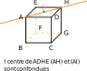
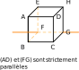
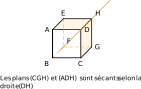
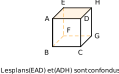
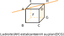
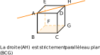
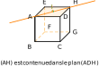

# Espace : droites, plans et vecteurs

## Positions relatives de droites et plans

:::tip Rappels

1.  Un plan est défini par :

- trois points non alignés ou

- deux droites sécantes ou

- deux droites strictement parallèles.

1.  Si un plan $\mathcal{P}$ contient deux points distincts $A$ et
    $B$ de l'espace,
    alors il contient la droite $(AB)$. On note
    $(AB)\subset \mathcal{P}$.

2.  Tous les résultats de géométrie plane (théorèmes de Thalès, de
    Pythagore...) s'appliquent dans chaque plan de l'espace.

:::

Dans la suite du paragraphe, $ABCDEFGH$ est un cube.

::: warning Propriétés
[Positions relatives de deux droites]

Deux droites de l'espace sont soit
coplanaires (c'est-à-dire qu'il existe un plan les
contenant toutes les deux), soit non coplanaires (c'est-à-dire qu'il
n'existe aucun plan les contenant toutes les deux).

Si elles sont coplanaires, alors elles sont soit sécantes, soit
parallèles (strictement parallèles ou confondues).
:::

| Droites coplanaires (dans un même plan) | Droites non coplanaires | Droites sécantes        | Droites strictement parallèles ou confondues |
| --------------------------------------- | ----------------------- | ----------------------- | -------------------------------------------- |
|                  |  |  |                       |

::: warning Propriétés [Positions relatives de deux plans]
Deux plans de l'espace sont soit sécants (leur intersection est une
droite), soit parallèles.
:::

| Plans sécants}          | Plans parallèles        |                         |
| ----------------------- | ----------------------- | ----------------------- |
|  |  |  |

::: warning Propriétés [Positions relatives d'une droite et d'un plan]
Une droite et un plan de l'espace sont soit sécants, soit parallèles.
:::

| Droite et plan sécants  | Droite et plan parallèles |                          |
| ----------------------- | ------------------------- | ------------------------ |
|  |   |  |
