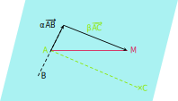
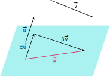
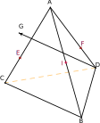

## Vecteurs de l'espace

::: tip Remarque
On étend à l'espace la définition et les propriétés des
vecteurs étudiées dans le plan.
:::

::: warning Propriétés [Vecteurs colinéaires]
Deux vecteurs non nuls $\vec{u}$ et $\vec{v}$ sont colinéaires si et
seulement si il existe un réel $k$ tel que $\vec{v}=k \vec{u}$. Par
convention, le vecteur nul est colinéaire à tout vecteur de
l'espace.
:::

::: warning Propriété [Caractéristique]
$A$ et $B$ étant deux points distincts de l'espace, la droite
$(AB)$ est l'ensemble des points $M$ de l'espace tels que
$\overrightarrow{AB}$ et $\overrightarrow{AM}$ soient colinéaires.

On dit que $\overrightarrow{AB}$ est un vecteur directeur de la
droite $(AB)$.
:::

::: warning Définition [Vecteurs coplanaires]

Trois vecteurs non nuls $\vec{u}$, $\vec{v}$ et $\vec{w}$ sont
coplanaires si et seulement leurs représentants de même origine $A$
ont des extrémités $B,C$ et $D$ telles que $A, B, C$ et $D$
appartiennent à un même plan.
:::

::: warning Propriété [Caractéristique]

$A$, $B$ et $C$ étant trois points non alignés de l'espace, le
plan $(ABC)$ est l'ensemble des points $M$ de l'espace tels que :

$\overrightarrow{AM}=\alpha\overrightarrow{AB}+\beta\overrightarrow{AC}$,
avec $\alpha$ et $\beta$ deux nombres réels.

On dit que $\overrightarrow{AB}$ et $\overrightarrow{AC}$ dirigent
le plan $(ABC)$.

:::

::: tip Preuve
$A$, $B$ et $C$ ne sont pas alignés. Les vecteurs
$\overrightarrow{AB}$ et $ \overrightarrow{AC}$ n'étant pas
colinéaires, $(A\,;\overrightarrow{AB},\overrightarrow{AC})$ est donc
un repère du plan $(ABC)$.

- Si $M$ appartient à $(ABC)$, alors $M$, $A$, $B$ et $C$ étant
  coplanaires, il existe $\alpha$ et $\beta$ deux nombres réels tels
  que
  $\overrightarrow{AM}=\alpha\overrightarrow{AB}+\beta\overrightarrow{AC}$.

- Réciproquement, si $M$ est un point de l'espace tel que \\
  $\overrightarrow{AM}=\alpha\overrightarrow{AB}+\beta\overrightarrow{AC}$,
  avec $\alpha$ et $\beta$ deux nombres réels, alors il existe un
  point $N$
  de la droite $(AB)$ tel que $\overrightarrow{AN}=\alpha\overrightarrow{AB}$.\\
  $\overrightarrow{AM}=\alpha\overrightarrow{AB}+\beta\overrightarrow{AC}\Leftrightarrow
\overrightarrow{NM}=\beta\overrightarrow{AC}$.
  $M$ est donc un point de la droite parallèle à $(AC)$ passant par
  $N$. Donc, comme $N\in(ABC)$, $M\in(ABC)$.

:::

::: warning Propriété

Soit trois vecteurs non nuls $\vec{u}$, $\vec{v}$ et $\vec{w}$
tels que $\vec{u}$ et $\vec{v}$ ne sont pas colinéaires.

$\vec{u}$, $\vec{v}$ et $\vec{w}$ sont coplanaires si et seulement
si il existe deux réels $\alpha$ et $\beta$ tels que\\
$\vec{w}=\alpha\vec{u}+\beta\vec{v}$.

:::

::: tip Preuve
Soit $A$, $B$, $C$ et $M$ les points de l'espace tels que
$\vec{w}=\overrightarrow{AM}$, $\vec{u}=\overrightarrow{AB}$ et
$\vec{w}=\overrightarrow{AC}$.

$\vec{u}$, $\vec{v}$ et $\vec{w}$ sont coplanaires si et seulement
si $A$, $B$, $C$ et $M$ sont coplanaires, c'est-à-dire si et
seulement si il existe deux réels $\alpha$ et $\beta$ tels que
$\vec{AM}=\alpha\vec{AB}+\beta\vec{AC}\Leftrightarrow
\vec{w}=\alpha\vec{u}+\beta\vec{v}$.
:::

::: tip Méthode [Démontrer que quatre points sont coplanaires]
Il s'agit de démontrer que trois vecteurs sont
coplanaires en écrivant l'un en fonction des deux autres.

**Exercice:**

Soit $ABCD$ un tétraèdre, $I$ le milieu de $[AB]$ ; $E$ et $F$ les
points définis par
$\overrightarrow{AE}=\dfrac{2}{3}\overrightarrow{AC}$ et
$\overrightarrow{AF}=\dfrac{2}{3}\overrightarrow{AD}$ et G le point
tel que $BCGD$ soit un parallélogramme.

1.  Exprimer les vecteurs $\overrightarrow{IE}$,
    $\overrightarrow{IF}$ et $\overrightarrow{IG}$ en fonction de
    $\overrightarrow{AB}$, $\overrightarrow{AC}$ et
    $\overrightarrow{AD}$.

2.  En déduire qu'il existe deux réels $\alpha$ et $\beta$ tels que
    $\overrightarrow{IG}=\alpha\overrightarrow{IE}+\beta\overrightarrow{IF}$.

3.  En déduire que les points $I, E, G$ et $F$ sont coplanaires.

**Correction**

1.

$$
\overrightarrow{IE} &= \overrightarrow{IA}+\overrightarrow{AE}=-\dfrac{1}{2}\overrightarrow{AB}+\dfrac{2}{3}\overrightarrow{AC}.\\

\overrightarrow{IF}
&=\overrightarrow{IA}+\overrightarrow{AF}=-\dfrac{1}{2}\overrightarrow{AB}+\dfrac{2}{3}\overrightarrow{AD}.\\

\overrightarrow {IG}&=\overrightarrow{IA}+\overrightarrow{AD}+\overrightarrow{DG}\\
&=-\dfrac{1}{2}\overrightarrow{AB}+\overrightarrow{AD}+\overrightarrow{BC}\\
&=-\dfrac{1}{2}\overrightarrow{AB}+\overrightarrow{AD}+\overrightarrow{BA}+\overrightarrow{AC}\\
&=-\dfrac{3}{2}\overrightarrow{AB}+\overrightarrow{AD}+\overrightarrow{AC}.
\end{aligned}
$$

1.  Il existe deux réels $\alpha$ et $\beta$ tels que
    $\overrightarrow{IG}=\alpha\overrightarrow{IE}+\beta\overrightarrow{IF}$

soit

$$
-\dfrac{3}{2}\overrightarrow{AB}+\overrightarrow{AD}+\overrightarrow{AC}=-\dfrac{\alpha}{2}\overrightarrow{AB}+\dfrac{2\alpha}{3}\overrightarrow{AC}-\dfrac{\beta}{2}\overrightarrow{AB}+\dfrac{2\beta}{3}\overrightarrow{AD}$$

Pour obtenir cette égalité, il suffit de prendre $\alpha$ et $\beta$
tels que :

$-\dfrac{3}{2}=-\dfrac{\alpha}{2}-\dfrac{\beta}{2}$ et $\dfrac{2}{3} \alpha=1$ et $\dfrac{2}{3} \beta=1$ , soit, $\alpha=\dfrac{3}{2}$ et $\beta=\dfrac{3}{2}$.

D'où
$\overrightarrow{IG}=\dfrac{3}{2}\overrightarrow{IE}+\dfrac{3}{2}\overrightarrow{IF}$

1.  On en déduit que les vecteurs $\overrightarrow{IE}$, $
\overrightarrow{IF}$ et $\overrightarrow{IG}$ sont coplanaires, donc
les points $I, E, G$ et $F$ sont coplanaires.

:::
$$
