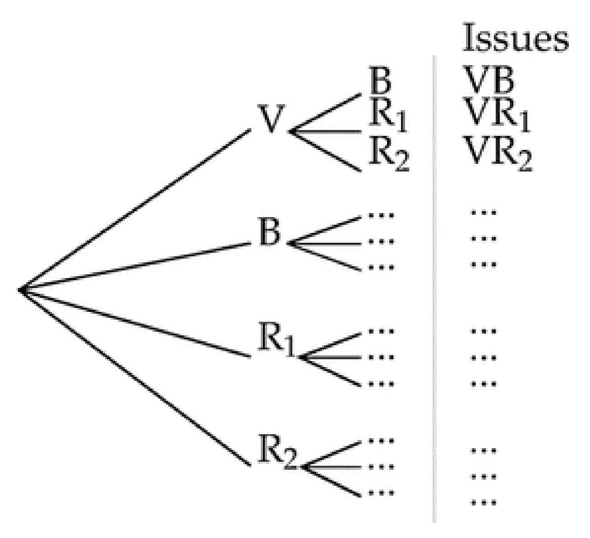
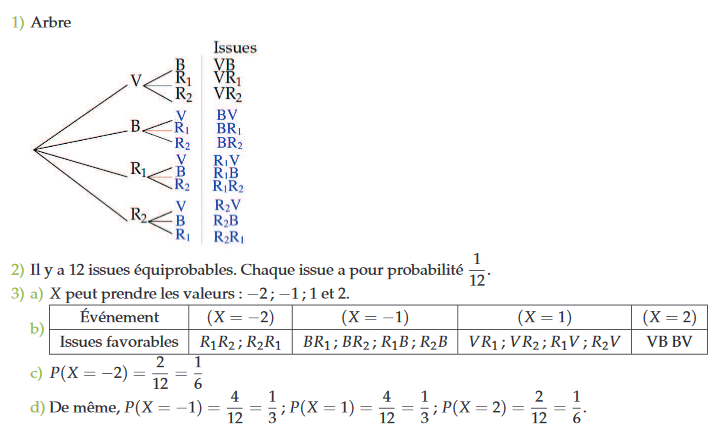
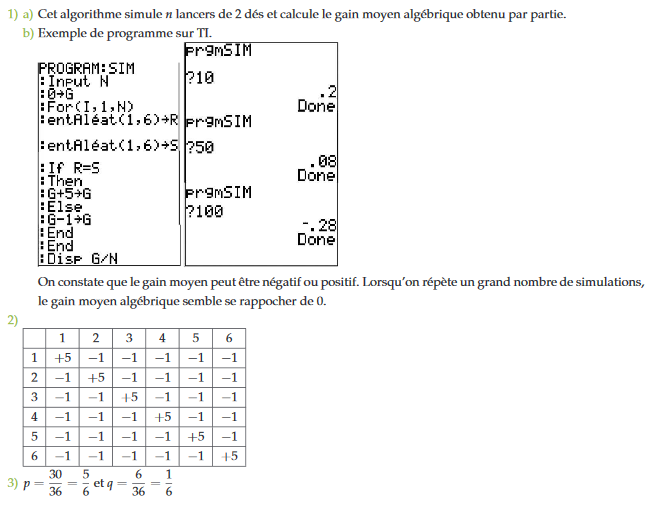

Activité
========

Une urne comprend une boule verte (V), une boule bleue (B) et deux
boules\
rouges (R$_{1}$ et R$_{2}$).

On tire au hasard une boule, puis une deuxième sans avoir remis la
première.

1\. Recopier et compléter l'arbre ci-contre afin de déterminer toutes\
les issues possibles.

2\. Quelle est la probabilité de chaque issue ?

3\. Une boule bleue ne rapporte rien et ne fait rien perdre, une boule
verte\
rapporte 2 points et chaque boule rouge fait perdre 1 point.

On s'intéresse au gain algébrique $X$ (positif ou négatif) que peut
obtenir\
un joueur à ce jeu.

3\. a) Quelles sont les valeurs possibles pour le gain ?

3\. b) Recopier et compléter le tableau.

       Événement       $\left( {X = - 2}   $\left( {X = - 1} \right)$   $\left( {X = 1}   $\left( {X = 2} \right)$
                           \right)$                                        \right)$      
  ------------------- ------------------- ---------------------------- ----------------- --------------------------
   Issues favorables                                                                     

3\. c) Calculer la probabilité, notée $P\left( {X
= - 2} \right)$, que le joueur perde 2 euros.

3\. d) Calculer de même $P\left( {X = - 1} \right)$, $P\left(
{X = 1} \right)$ et $P\left( {X = 2} \right)$.

**Correction**

COMMENTAIRES :

$X$ s'appelle une variable aléatoire : \"variable\" car elle prend des
valeurs numériques qui varient et \"aléatoire\" car ces valeurs prises
dépendent du hasard.

Dans une expérience aléatoire, on cherche d'abord à l'aide de l'énoncé
TOUTES les valeurs possibles que peut prendre $X$.

On veut ensuite trouver avec quelle probabilité chacune de ces valeurs
peut être obtenue : on appelle cela le tableau de loi de la variable
aléatoire $X$.

Une fois connu le tableau de loi on peut répondre à n'importe quelle
question sur cette expérience et pourquoi pas, parier en toute
connaissance de cause.

Dans ce cours, on va formaliser tout ceci :

Notion de variable aléatoire réelle
===================================

**Remarque**

$x$ est un réel, l'événement \"$X$ prend la valeur $x$\" est noté
($X = x$), il est formé de toutes les issues de $\Omega$ ayant pour
image $x$.

**Application et méthode :**

**Enoncé:** On lance un dé à 6 faces.

Si on obtient un multiple de 3, on gagne 2 euros.

Sinon, on perd 1 euro.

$X$ est la variable aléatoire qui à chaque lancer associe le gain obtenu
(ce gain peut éventuellement être négatif)

**Méthode**

On cherche toutes valeurs possibles prises par la variable aléatoire
$X$.

On écrit : $X$ désigne \...\...\...

puis : $X$ prend les valeurs \...\...\...\...\....

**Solution**

$X$ désigne le gain obtenu à un lancer

$X$ prend les valeurs 1 ou 2

L'évènement $(X=2)$ est réalisé lorsque l'on obtient un multiple de 3

L'évènement $(X \leq 0)$ est réalisé lorsque le gain est négatif

Loi de probabilité d'une variable aléatoire réelle
==================================================

**Remarque**

La loi de probabilité d'une variable aléatoire se présente à l'aide d'un
tableau.

| ${x_i}$                       | ${x_1}$ |   |   |   |
|-------------------------------|---------|---|---|---|
| $P\left( {X = {x_i}} \right)$ | ${p_1}$ |   |   |   |

${x_i}$ & ${x_1}$ & ${x_2}$ & ... & ${x_n}$\
$P\left( {X = {x_i}} \right)$ & ${p_1}$ & ${p_2}$ & ... & ${p_n}$\

On a $P\left( {X = {x_1}} \right) + P\left( {X = {x_2}} \right) +
... + P\left( {X = {x_n}} \right) = 1$.

**METHODE A TRAVAILLER**

Étudier une variable aléatoire :

:::exercice Exercice 1:

Une urne contient cinq jetons indiscernables au toucher numérotés de 1 à
5.

Un joueur participe à la loterie en payant 2 €, ce qui lui donne le
droit de prélever au hasard un jeton dans l'urne.

-   Si le numéro est pair, il gagne en euros le double de la valeur
    indiquée par le jeton.

-   Si le numéro est impair, il perd sa mise.

Soit $X$ la variable aléatoire égale au \"gain algébrique\".

Déterminer la loi de probabilité de $X$.

:::

CORRECTION :

L'univers est l'ensemble des 5 jetons.

Les cinq issues sont équiprobables.

Les jetons 1, 3 et 5 font perdre 2 euros ;

le jeton 2 fait gagner $2 \times 2 - 2 = 2$ euros ;

le jeton 4 fait gagner $4 \times 2 - 2 = 6$ euros.

$X$ peut prendre les valeurs $- 2$ ; 2 et 6.

L'événement $\left( {X = - 2} \right)$ est réalisé pour les issues 1 ; 3
; 5 donc $P\left( {X = - 2} \right) =
\dfrac{3}{5}$.

L'événement $\left( {X = 2} \right)$ est réalisé pour l'issue 2 donc
$P\left( {X = 2} \right) = \dfrac{1}{5}$.

L'événement $\left( {X = 6} \right)$ est réalisé pour l'issue 4 donc
$P\left( {X = 6} \right) = \dfrac{1}{5}$.

On présente la **loi de probabilité** de $X$ dans un tableau.

\|\*4c\| ${x_i}$ & $- 2$ & 2 & 6\
$P\left( {X = {x_i}} \right)$ & $\dfrac{3}{5}$ & $\dfrac{1}{5}$ &
$\dfrac{1}{5}$\

Espérance, variance et écart-type
=================================

Dans cette partie, $X$ est une variable aléatoire réelle définie sur un
univers $\Omega$ prenant les valeurs $x_1$​, $x_2$​, \..., $x_r$​ avec
les probabilités respectives $p_1$​, $p_2$​, \..., $p_r$​.

Espérance d'une variable aléatoire
----------------------------------

**Remarque:**

$E(X)$ peut s'interpréter comme la valeur moyenne des valeurs prises par
$X$ lorsque l'expérience aléatoire est répétée un très grand nombre de
fois.

**Exemple:**

La loi de probabilité d'une variable aléatoire $X$ est donnée ci-dessous
:

     $x_i$​           $-2$              1                4
  ------------- ---------------- ---------------- ----------------
   $P(X=x_i​)$   $\frac{1}{6}$​   $\frac{1}{2}$​   $\frac{1}{3}​$

On a
$E(X)=−2 \times \frac{1}{6}​+1 \times \frac{1}{2}​+4 \times \frac{1}{3}​=\frac{3}{2}​$.

Sur un très grand nombre d'expériences, en moyenne, la valeur de $X$ est
$\frac{3}{2}$​.

**Remarque:**

*Démonstration à faire plus tard*

**METHODE**

:::exercice Exercice 2:

Soit X une variable aléatoire dont on donne la loi de probabilité dans
le tableau suivant. Calculer et interpréter $E(X)$.

     $x_i$​      $-2$      1       4
  ------------- ------- ------- -------
   $P(X=x_i​)$   $0,2$   $0,5$   $0,3$

:::

**Méthode**

1\. On applique la formule du cours en remplaçant les $x_i​$ par les
valeurs prises par la variable aléatoire $X$ et les $p_i$​ par les
probabilités correspondantes.

2\. On interprète le résultat à l'aide d'une moyenne en se rappelant que
cela est valable uniquement pour un très grand nombre d'expériences
identiques réalisées.

**Correction:**

$E(X)=−2 \times 0,2+1 \times 0,5+4 \times 0,3=1,3$

Sur un très grand nombre de répétitions de cette expérience aléatoire,
la valeur moyenne de $X$ est $1,3$.

Variance et écart-type d'une variable aléatoire
-----------------------------------------------

**Remarque:**

L'écart-type de $X$ est la moyenne quadratique des écarts des valeurs
avec l'espérance.

**Exemple:**

On reprend la variable aléatoire $X$ de l'exemple précédent.

On a:

$Var(X)​=\frac{1}{6} \times (-2-\frac{3}{2}​)^2+\frac{1}{2}​ \times (1-\frac{3}{2}​)^2+\frac{1}{3} \times (4-\frac{3}{2}​)^2=\frac{1}{6}​ \times (-\frac{7}{2})^2+\frac{1}{2}​ \times (−\frac{1}{2})^2+\frac{1}{3} \times (2\frac{5}{2})^2=\frac{1}{6} \times \frac{49}{4}​+\frac{1}{2} \times \frac{1}{4}+\frac{1}{3} \times \frac{25}{4}​=\frac{17}{4}$

et

$\sigma(X)=\sqrt{Var(X)}=\sqrt{\frac{17}{4}}=\frac{\sqrt{17}}{2}$ ​

​​**Exemple:**

:::exercice Exercice 3:

Soit $X$ une variable aléatoire dont on donne la loi de probabilité dans
le tableau suivant. Calculer la variance et l'écart-type de la variable
aléatoire $X$.

     $x_i$​      $-2$      1       4
  ------------- ------- ------- -------
   $P(X=x_i​)$   $0,2$   $0,5$   $0,3$

:::

**Méthode:**

-   On applique la formule du cours en remplaçant les $x_i$​ par les
    valeurs prises par la variable aléatoire $X$ et les $p_i$​ par les
    probabilités correspondantes.

-   L'écart-type s'obtient simplement en calculant la racine carrée de
    la variance

**Correction:**

On a vu précédemment que $E(X)=1,3$.

On a alors :

$Var(X)​=0,2 \times (−2−1,3)^2+0,5 \times (1−1,3)^2+0,3 \times (4−1,3)^2=0,2 \times (−3,3)^2+0,5 \times 0,32+0,3 \times 2,72=0,2 \times 10,89+0,5 \times 0,09+0,3 \times 7,29=2,178+0,045+2,187=4,41​$

D'où $\sigma(X)=\sqrt{Var(X)}=\sqrt{4,41}=2,1$

Simulation d'une variable aléatoire
===================================

Un jeu consiste à lancer $n$ fois deux dés parfaitement équilibrés.

Lorsqu'on obtient un double, on gagne 5 euros, sinon on perd 1 euro.

    from random import randint
    n=int(input("Quel est le nombre de lancers?"))
    G=0
    for i in range(n):
    R=randint(1,6)
    S=randint(1,6)
    if R==S:
    G=G+5
    else:
    G=G-1
    print(G/n)

1\. On considère l'algorithme ci-dessus.

1\. a) Qu'affiche cet algorithme ?

1\. b) Programmer cet algorithme sur une calculatrice ou un logiciel.

Effectuer plusieurs simulations pour $n$ = 10 ; $n$ = 50 et $n$ = 100.
Que constate-t-on ?

2\. Recopier et compléter le tableau à double entrée.

\|\*7c\| & 1 & 2 & 3 & 4 & 5 & 6\
1 & +5 & $-1$ & & & &\
2 & & & & & &\
3 & & & & & &\
4 & & & & & &\
5 & & & & & &\
6 & & & & & &\

3\. Calculer la probabilité $p$ de perdre 1 euro, puis la probabilité
$q$ de gagner 5 euros à ce jeu.

4\. Soit $X$ la variable aléatoire correspondant au gain de ce jeu.

-   Quelles sont les valeurs prises par $X$ ?

-   Donner le tableau de loi de la variable aléatoire $X$ (vous pouvez
    vous aider de la question précédente)

-   Calculer l'espérance de $X$

-   Que pensez-vous du gain moyen que peut espérer le joueur sur un
    grand nombre de parties ? Ce jeu favorise-t-il le joueur ou
    l'organisateur ?

**Correction:**

$X$ prend les valeurs $5$ ou $-1$.

$P(X=5)=\frac{cas favorables}{cas possibles}=\frac{6}{36}=\frac{1}{6}$

$P(X=-1)=\frac{cas favorables}{cas possibles}=\frac{30}{36}=\frac{5}{6}$

Loi de probabilité :

     $x_i$            5             $-1$
  ------------ --------------- ---------------
   $P(X=x_i)$   $\frac{1}{6}$   $\frac{5}{6}$

Calcul de l'espérance :

$E(X)=5 \times \frac{1}{6}+(-1) \times \frac{5}{6}=0$

L'espérance est nulle, le jeu est donc équitable (le jeu ne favorise ni
le joueur ni l'organisateur)