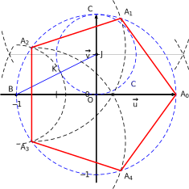

# Complexes: Exercices type Bac

[[toc]]

## Complexes

### S-Pondichery avril 2016 - Exo 2

::: tip Exercice 1 [S-Pondichery avril 2016 - Exo 2][3]
L'objectif de cet exercice est de trouver une méthode pour construire à la règle et au compas
un pentagone régulier.

Dans le plan complexe muni d'un repère
orthonormé direct (O; $\vec{u}$, $\vec{v}$), on considère le pentagone régulier $A_0A_1A_2A_3A_4$, de centre $O$ tel
que $\overrightarrow{OA_0} = \overrightarrow{u}$.

On rappelle que dans le pentagone régulier $A_0A_1A_2A_3A_4$, ci-contre :

- les cinq côtés sont de même longueur;

- les points $A_0,\:A_1,\:A_2,\:A_3$ et $A_4$
  appartiennent au cercle trigonométrique ;

- pour tout entier $k$ appartenant à $\{0;1;2;3\}$ on a

$\left(\overrightarrow{OA_k};\overrightarrow{OA_{k+1}}\right) = \dfrac{2\pi}{5}$.

1.  On considère les points $B$ d'affixe $- 1$ et $J$ d'affixe $\dfrac{\text{i}}{2}$.

Le cercle $\mathcal{C}$ de centre $J$ et de rayon $\dfrac{1}{2}$ coupe le segment $[BJ]$ en un point $K$.

Calculer $BJ$, puis en déduire $BK$.
<ClientOnly><Solution>
Le théorème de Pythagore appliqué au triangle $OBJ$ rectangle en $O$ donne :

$BJ^2  = BO^2 + OJ^2 = 1^2  + \left (\dfrac{1}{2}\right )^2  = \dfrac{5}{4} \Rightarrow BJ = \displaystyle\sqrt{\dfrac{5}{4}} = \dfrac{\sqrt{5}}{2}$.

$BK = BJ - KI = \dfrac{\sqrt{5}}{2} - \dfrac{1}{2} = \dfrac{\sqrt{5} - 1}{2}$
</Solution>

2.

a) Donner sous forme exponentielle l'affixe du point $A_2$. Justifier brièvement.
<ClientOnly><Solution>
L'affixe de $A_2$ a pour module 1 et pour argument $\dfrac{2\pi}{5} + \dfrac{2\pi}{5} = \dfrac{4\pi}{5}$. Donc $z_{A_2} = \text{e}^{\text{i}\frac{4\pi}{5}}$
</Solution>

b) Démontrer que $BA_2\,^2 = 2 +  2\cos \left(\dfrac{4\pi}{5}\right)$.
<ClientOnly><Solution>
$BA_2\,^2 = \left|z_{A_2} - z_{B} \right|^2\\
\phantom{BA_2\,^2} = \left|\text{e}^{\text{i}\frac{4\pi}{5}} - (- 1) \right|^2\\
\phantom{BA_2\,^2} = \left|\text{e}^{\text{i}\frac{4\pi}{5}} + 1 \right|^2\\
\phantom{BA_2\,^2} = \left|\cos \dfrac{4\pi}{5} + 1 + \text{i}\sin  \dfrac{4\pi}{5}\right|^2\\
\phantom{BA_2\,^2} = \left(\cos \dfrac{4\pi}{5} + 1 \right)^2 + \sin ^2 \dfrac{4\pi}{5}\\
\phantom{BA_2\,^2} = \cos^2 \dfrac{4\pi}{5}  + 2\cos \dfrac{4\pi}{5} + 1 + \sin^2 \dfrac{4\pi}{5}\\
\phantom{BA_2\,^2} = 2 +  2\cos \left(\dfrac{4\pi}{5}\right)$
</Solution>

c) Un logiciel de calcul formel affiche les résultats ci-dessous, que l'on pourra utiliser
sans justification :

$\blacktriangleright$ Calcul formel:

$$
\begin{matrix}
1&cos (4*pi/5)\\
&\to \dfrac{1}{4}\left(- \sqrt{5} - 1\right)\\ \hline
2&sqrt((3 - sqrt(5))/2)\\ \hline
&\to \dfrac{1}{2}\left(\sqrt{5} - 1\right)\\ \hline
\end{matrix}
$$

En déduire, grâce à ces résultats, que $BA_2 = BK$.
<ClientOnly><Solution>
D'après le logiciel de calcul formel, $\cos \dfrac{4\pi}{5} = \dfrac{1}{4}\left (-\sqrt{5}- 1\right )$ donc:

$BA_2^2 = 2 + 2\times \dfrac{1}{4}\left(- \sqrt{5} - 1\right) = 2 - \dfrac{1}{2} - \dfrac{\sqrt{5}}{2} = \dfrac{3 - \sqrt{5}}{2}$

Donc $BA_2 = \displaystyle\sqrt{\dfrac{3 - \sqrt{5}}{2}} = \dfrac{1}{2}\left (\sqrt{5}-1\right )$ d'après le logiciel de calcul formel.

On en déduit que $BA_2=BK$.
</Solution>

1.  Dans le repère (O; $\vec{u}$, $\vec{v}$) donné en annexe, construire à la règle et au compas un pentagone régulier. N'utiliser ni le rapporteur ni les graduations de la règle et laisser apparents les traits de construction.
    <ClientOnly><Solution>
    Procédé de construction (voir figure )

1.  Soit $C$ le point de coordonnées (0;1). La médiatrice de $[\text{O}C]$ coupe l'axe des ordonnées au point $J$ de coordonnées $\left(0;\frac{1}{2}\right)$.

On place le point $B$ sur l'axe des abscisses, d'abscisse négative tel que OB = 2OJ, on construit $[BJ]$ et le cercle $\mathcal C$ centré en $J$ passant par $O$ donc de rayon $\dfrac{1}{2}$ ;

5.  on obtient le point $K$ à l'intersection du cercle $\mathcal C$ et du segment $[BJ]$;

6.  le cercle de centre $B$ de rayon $BK$ coupe le cercle unitaire aux points $A_2$ et $A_3$ ;

7.  le cercle de centre $A_2$ passant par $A_3$ recoupe le cercle unitaire en $A_1$;

8.  le cercle de centre $A_3$ passant par $A_2$ recoupe le cercle unitaire en $A_4$;

9.  le point $A_0$ est le point d'affixe 1.

</Solution>

ANNEXE

:::
