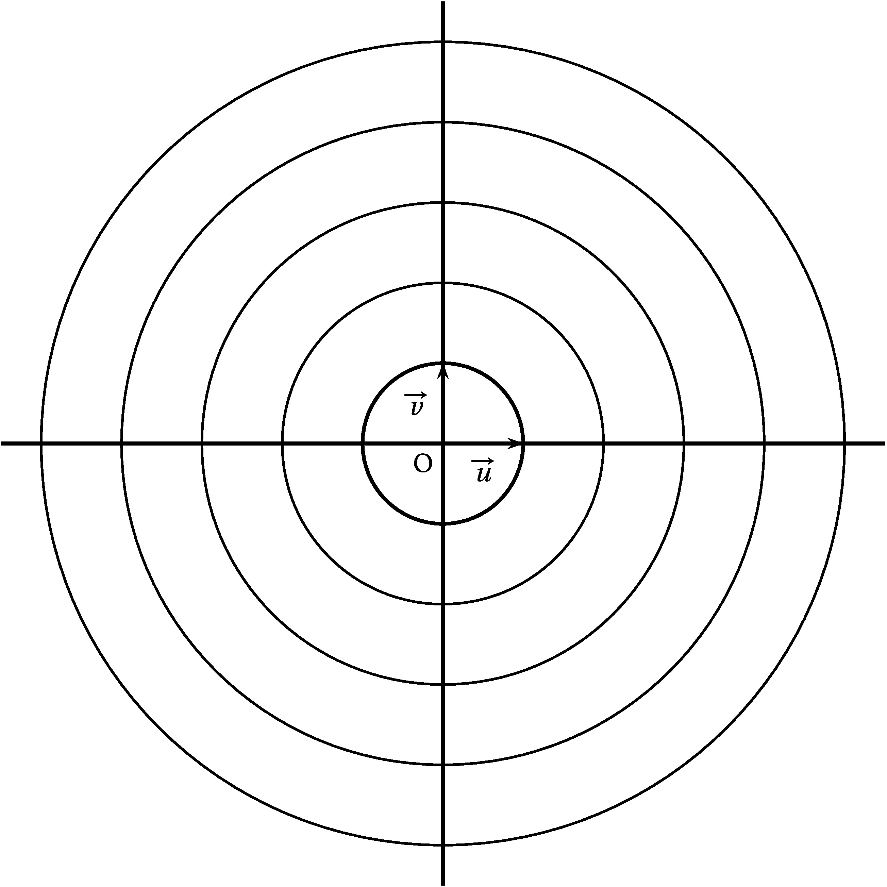
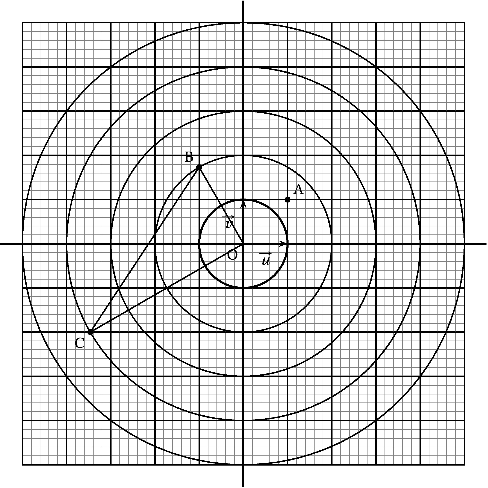

## Exercice 1

8 points

On note i le nombre complexe de module 1 et d'argument $\dfrac{\pi}{2}$.

1\. On considère le nombre complexe
$z_1 = \sqrt{2}\text{e}^{\text{i}\frac{\pi}{4}}$.

1\. a) Écrire $z_1$ sous forme algébrique.

<ClientOnly><Solution>
On sait que
$\cos \frac{\pi}{4} = \sin \frac{\pi}{4} = \frac{\sqrt{2}}{2}$, donc

$z_1 = \sqrt{2}\text{e}^{\text{i}\frac{\pi}{4}} = \sqrt{2}\left(\cos \frac{\pi}{4} + \text{i} \sin \frac{\pi}{4}\right) = \sqrt{2}\left(\frac{\sqrt{2}}{2} + \text{i}\frac{\sqrt{2}}{2} \right) = 1 + \text{i}$.
</Solution>

1\. b) Vérifier que $z_1$ est solution de l'équation
$(2 + \text{i})z = 1 + 3\text{i}$.

<ClientOnly><Solution>
$\bullet~~$En remplaçant dans l'équation :

$(2 + \text{i})(1 + \text{i}) = 1 + 3\text{i} \iff 2 + 2\text{i} + \text{i} - 1 = 1 + 3\text{i}$
qui est vraie.

$\bullet~~$En résolvant l'équation :

$(2 + \text{i})z = 1 + 3\text{i} \iff z = \dfrac{1 + 3\text{i}}{(2 + \text{i})} = \dfrac{(1 + 3\text{i})(2 - \text{i})}{(2 + \text{i})(2 - \text{i})} = \dfrac{2 + 3 + 6\text{i} - \text{i}}{4 + 1} = \dfrac{5 + 5\text{i}}{5} = 1 + \text{i}$
</Solution>

2\. Écrire le nombre complexe $z_2 = - 1 + \text{i}\sqrt{3}$ sous forme
exponentielle.

<ClientOnly><Solution>
On calcule d'abord le module de $z_2$ :

$\left|z_2\right|^2 = 1 + 3 = 4 = 2^2$, donc $\left|z_2\right| = 2$.

On factorise ce module dans l'écriture de $z_2$ :

$z_2 = 2\left(- \dfrac{1}{2} + \text{i}\dfrac{\sqrt{3}}{2} \right)$.

On reconnait $- \dfrac{1}{2} = \cos \frac{2\pi}{3}$ et
$\dfrac{\sqrt{3}}{2} = \sin \frac{2\pi}{3}$, donc

$z_2 = 2\left(\cos \frac{2\pi}{3} + \text{i}\sin  \frac{2\pi}{3}\right) = 2\text{e}^{\text{i}\frac{2\pi}{3}}$.
</Solution>

3\. On considère $z_3$ le nombre complexe de module 4 et d'argument
$\dfrac{7\pi}{6}$.

Vérifier que $z_3 = z_1^2 \times z_2$.

<ClientOnly><Solution>
On a donc $z_3 = 4\text{e}^{\frac{7\pi}{6}}$.

D'autre part
$z_1^2 \times z_2 = \left(\sqrt{2}\text{e}^{\text{i}\frac{\pi}{4}}\right)^2\times 2\text{e}^{\text{i}\frac{2\pi}{3}} = 2\text{e}^{\text{i}\frac{\pi}{2}}\times 2\text{e}^{\frac{2\pi}{3}} = 4 \text{e}^{\text{i}\left(\frac{\pi}{2} + \frac{2\pi}{3}\right)} = 4\text{e}{\text{i}\left(\frac{3\pi}{6}  + \frac{4\pi}{6}\right)} = 4\text{e}^{\text{i}\frac{7\pi}{6}}$.

On a donc $z_3 = z_1^2 \times z_2$. 
</Solution>

4\. Le plan complexe est muni d'un repère orthonormé
$\left(\text{O};~\overrightarrow{u},~\overrightarrow{v}\right)$.

On considère les trois points A, B et C d'affixes respectives
$z_{\text{A}} = 1 + \text{i}$, $z_{\text{B}} = - 1 + \text{i}\sqrt{3}$
et

$z_{\text{C}} = -2\sqrt{3} - 2\text{i}$.

4\. a) Placer les points A, B et C dans le plan complexe ci-dessous. On
laissera les éventuels traits de construction apparents.

<ClientOnly><Solution>

</Solution>

4\. b) Démontrer que le triangle OBC est rectangle en O.

<ClientOnly><Solution>
On a $\overrightarrow{\text{OB}}
\begin{pmatrix}-1\\\sqrt{3}\end{pmatrix}
$ et $\overrightarrow{\text{OC}}
\begin{pmatrix}-2\sqrt{3}\\- 2\end{pmatrix}
$.

Calculons le produit scalaire
$\overrightarrow{\text{OB}} \cdot \overrightarrow{\text{OC}} = - 1 \times (-2\sqrt{3}) + \sqrt{3} \times (- 2) = 2\sqrt{3} - 2\sqrt{3} = 0$
; les vecteurs $\overrightarrow{\text{OB}}$ et
$\overrightarrow{\text{OC}}$ sont orthogonaux, donc les droites (OB) et
(OC) sont perpendiculaires, donc le triangle OBC est rectangle en O.
</Solution>

## Exercice 2

2 points

On note $u$ le nombre complexe $u=2+2i$ et on note $\overline{u}$ son
conjugué.

Démontrer que: $u^{2020}+\overline{u}^{2020}=-2^{3031}$

<ClientOnly><Solution>
$|u|=...=2\sqrt{2}$ et après calculs on obtient:
$\arg(u)=\frac{\pi}{4}$. En utilisant les propriétés sur les modules et
arguments:
$|u^{2020}|=|u|^{2020}=(2\sqrt{2})^{2020}=2^{2020}\times\sqrt{2}^{2020}=2^{2020}\times2^{1010}=2^{3030}$
$\arg\left(u^{2020}\right)=2020\times\arg(u)=2020\times\frac{\pi}{4}=505\pi \equiv \pi [2\pi]$.
Donc $u$ a pour module $2^{3030}$ et argument $\pi$. Donc $u=-2^{3030}$
On a alors: $\overline{u}^{2020}=\overline{u^{2020}}=-2^{3030}$ et donc
$u^{2020}+\bar{u}^{2020} = 2\times\left(-2^{3030}\right)= -2^{3031}$
</Solution>

