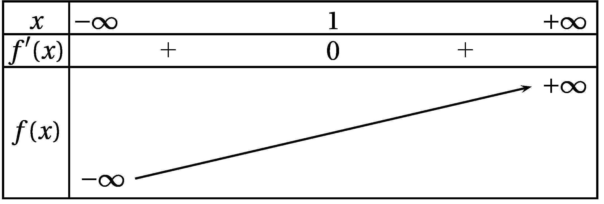
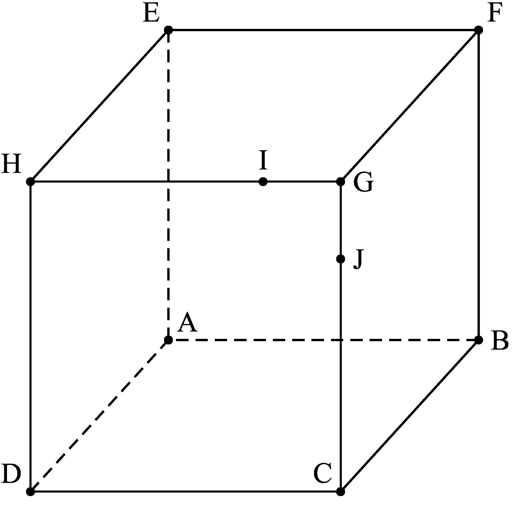
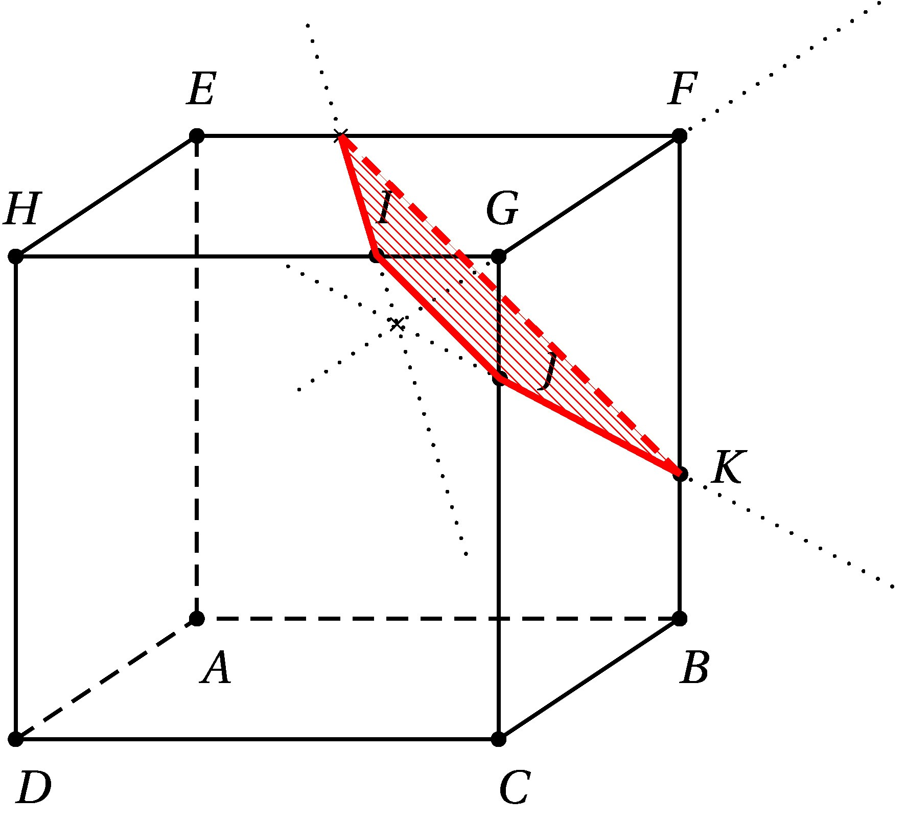
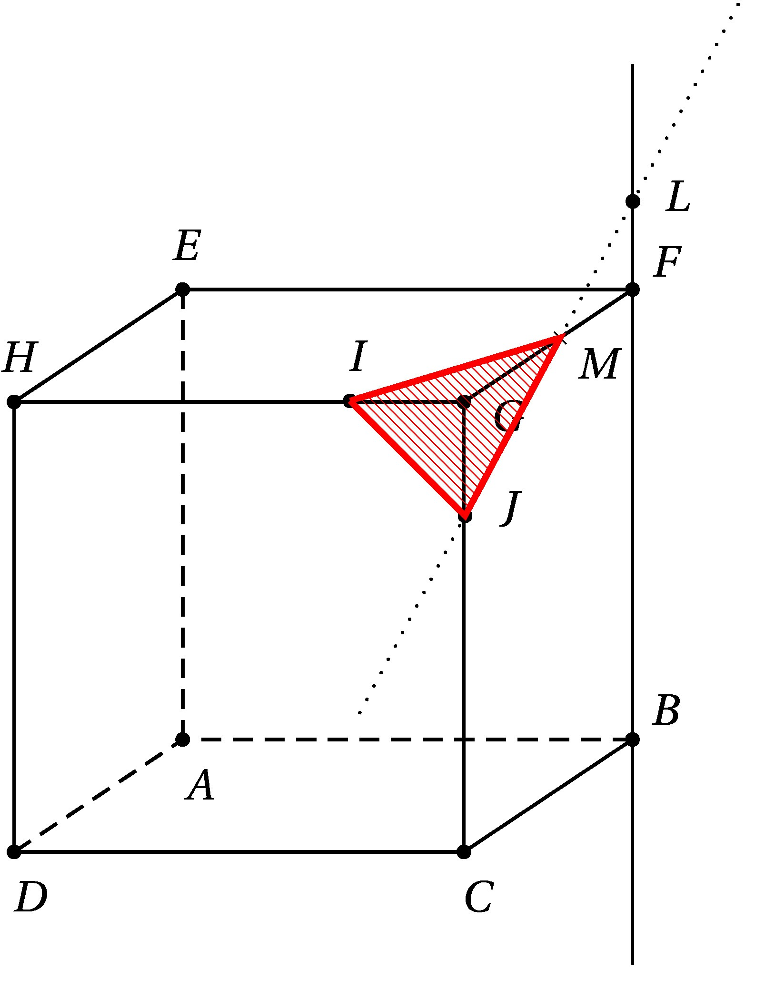
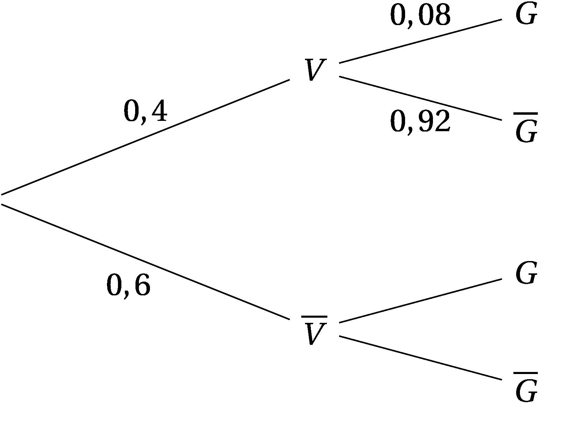
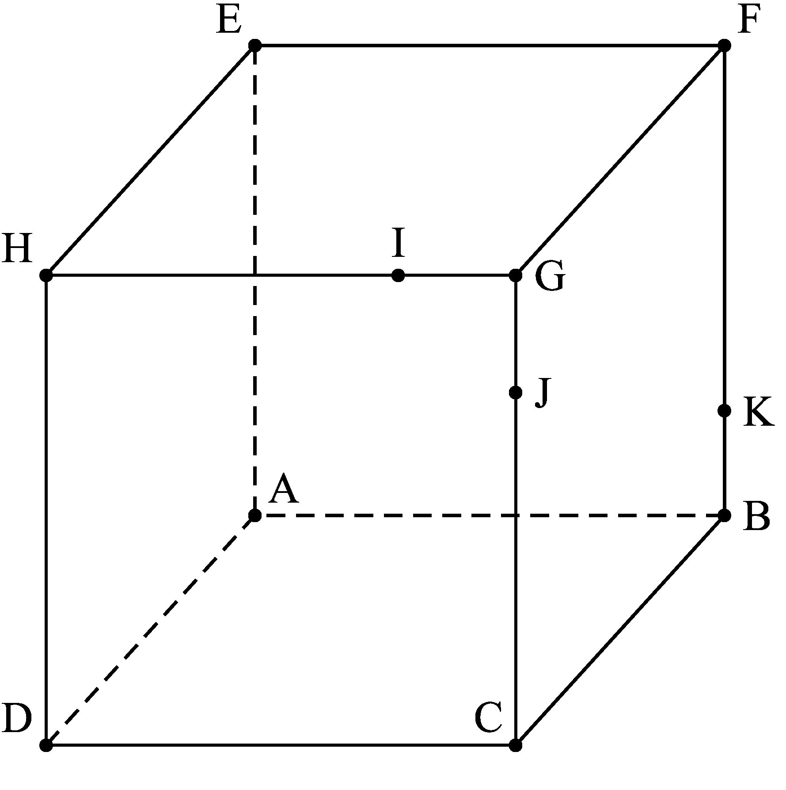
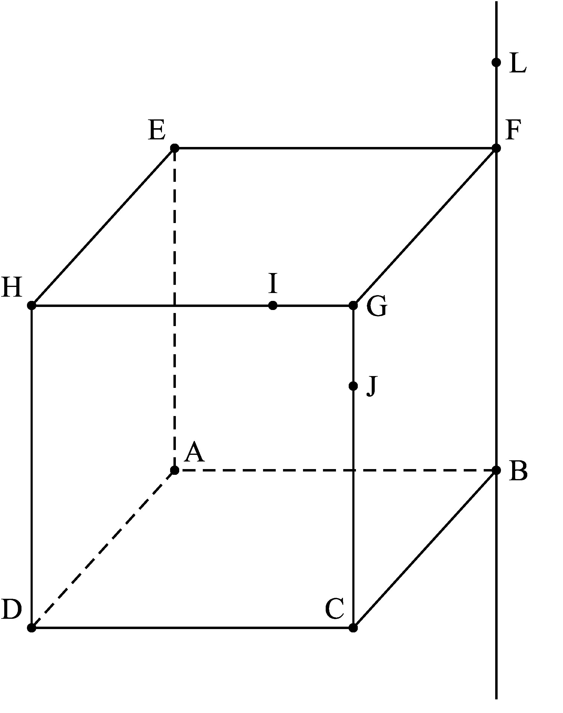

BACCALAURÉAT BLANC - Lycée de Cornouaille

Mars 2020 - 8h/12h

MATHÉMATIQUES\
Obligatoire

Série S

Durée de l'épreuve: 4 heures\
Coefficient: 7

Les calculatrices sont autorisées,\
conformément à la réglementation en vigueur.

Le sujet est composé de 4 exercices indépendants.Le candidat doit
traiter tous les exercices.\
Dans chaque exercice, le candidat peut admettre un résultat précédemment
donné dans le texte pour aborder les questions suivantes, à condition de
l'indiquer clairement sur la copie.\
Le candidat est invité à faire figurer sur sa copie toute trace de
recherche, même incomplète ou non fructueuse, qu'il aura développée.\
Il est rappelé que la qualité de la rédaction, la clarté et la précision
des raisonnements seront prises en compte dans l'appréciation des
copies.

**Avant de composer, le candidat s'assurera que le sujet comporte bien 7
pages.**

**La page 7 est une annexe à rendre avec la copie.**

:::exercice Exercice 1: Commun à tous les candidats /5 points

*Pour chacune des cinq affirmations suivantes, indiquer si elle est
vraie ou fausse, en justifiant la réponse.\
Une réponse non justifiée n'est pas prise en compte.*

**1.** On considère le nombre complexe $z = 1 + \text{i}\sqrt{3}$.

**Affirmation 1** : Le nombre complexe $z^2$ est un réel positif.

:::startsolution

$z^2 = \left(1 + \text{i}\sqrt{3} \right)^2 = 1 - 3 + 2\text{i}\sqrt{3} = - 2 + 2\text{i}\sqrt{3}$
qui n'est pas un réel.

:::endsolution

**Affirmation 2** : L'argument du nombre complexe $z^{2019}$ vaut 0
modulo $2\pi$.

:::startsolution

On a $|z|^2 = 1 + 3 = 4 = 2^2$, d'où $|z| = 2$. On peut en factorisant 2
écrire :

$z = 2\left( \dfrac{1}{2} + \text{i}\dfrac{\sqrt{3}}{2}\right) = 2\left( \cos \dfrac{\pi}{3} + \text{î}\sin \dfrac{\pi}{3}\right) = 2 \text{e}^{\text{i}\frac{\pi}{3}}$.

Il suit que :
$z^{2019} = \left[ 2 \text{e}^{\text{i}\frac{\pi}{3}} \right]^{2019} = 2^{2019} \text{e}^{\text{i}\frac{2019\pi}{3}} = \text{e}^{673\text{i}\pi}$.

Or $673\pi = 672\pi + \pi$ donc un argument de $z^{2019}$ est $\pi$ à
$2\pi$ près.

L'affirmation est fausse.

:::endsolution

Dans ce qui suit, le plan complexe est muni d'un repère orthonormé
direct $\left(\text{O};~\overrightarrow{u},~\overrightarrow{v}\right)$.

**1.** On considère les points A, B et C d'affixes respectives
$z_{\text{A}} = \sqrt{2} + 3\text{i},\: z_{\text{B}} = 1 + \text{i}$ et
$z_{\text{C}} = - 4\text{i}$.

**Affirmation 3** : Les points A, B et C ne sont pas alignés.

:::startsolution

Soit
$Z=\dfrac{z_A-z_C}{z_B-z_C}=\dfrac{\sqrt{2}+7\text{i}}{1+5\text{i}}=\dfrac{1}{16}\left(\sqrt{2}+7\text{i} \right)\left(1-5\text{i} \right)=\dfrac{1}{16}\left(\vphantom{\dfrac{numérateur}{dénominateur}} (\sqrt{2}+35)+(7-5\sqrt{2})\text{i}\right)$

$Z \notin \R$ donc $arg(Z) \neq 0 (\pi)$    or   
$arg(Z)=arg\left(\dfrac{z_A-z_C}{z_B-z_C} \right)=\left(\overrightarrow{CB}~;~\overrightarrow{CA} \right) (2\pi)$

On en déduit que
$\left(\overrightarrow{CB}~;~\overrightarrow{CA} \right) \neq 0 (\pi)$
donc $A~,~B~\text{et}~C$ ne sont pas alignés.

L'affirmation est VRAIE.

:::endsolution

**2.** On considère dans l'équation $2z^2 - 3z + 5 = 0$.

**Affirmation 4** : Cette équation admet deux solutions dont les images
sont symétriques par rapport à l'origine du repère.

:::startsolution

On a $\Delta = 9 - 4 \times 2 \times 5 = 9 - 40 = - 31$ : cette équation
a deux solutions complexes :

$z_1 - \dfrac{3 + \text{i}\sqrt{39}}{4}$
$z_1 - \dfrac{3 - \text{i}\sqrt{39}}{4}$ : les images de ces deux
complexes sont symétriques autour de l'axe des abscisses. L'affirmation
est fausse.

:::endsolution

**3.** À tout point $M$ d'affixe $z$ du plan complexe, on associe le
point $M'$ d'affixe $z'$ définie par :

$$z' = \overline{z}(1- z).$$

**Affirmation 5** : Il existe une infinité de points $M$ confondus avec
leur point image $M'$.

:::startsolution

$M = M' \iff z' = z = \overline{z}(1- z)$.

Avec $z = x + \text{i}y$, d'où $\overline{z} = x  - \text{i}y$, on
obtient :

$z' = z \iff x + \text{i}y = ( x - \text{i}y)( 1 - x - \text{i}y) \iff x + \text{i}y = x(1 - x)  - y^2 + \text{i}[- xy + y(x - 1)]$.

En identifiant les parties réelles et imaginaires on obtient
respectivement :

$\left\{
\begin{array}{l c l}
x&=&x(1 - x) - y^2\\
y&=&- xy + y(x - 1)
\end{array}

\right.$

La première équation donne $x^2 + y^2 = 0$, équation qui n'est vérifiée
que par le couple (0 ; 0).

La deuxième équation donne $y = -xy  + xy - y$ soit : $2y = 0$ d'où
$y = 0$.

Les deux conditions devant être réalisées, le seul point confondu avec
son image est l'origine O. L'affirmation est fausse.

:::endsolution

:::

:::exercice Exercice 2: Commun à tous les candidats /5 points

**Partie A**

Soit $f$ la fonction définie sur $\R$ par

$$f(x) = x - \ln \left(x^2 + 1\right).$$

**1.** Résoudre dans $R$ l'équation : $f(x) =x$.

:::startsolution

Soit $x\in\R$ :

$\begin{array}[t]{llcl}
&f(x)&=&x\\
\iff&x-\ln(x^2+1)&=&x\\
\iff&\ln(x^2+1)&=&0\\
\iff&x^2+1&=&e^0\\
\iff&x^2&=&0\\
\iff&x&=&0\\
\end{array}
$

$$\text{L'équation }f(x)=x\text{ admet 0 pour unique solution}$$

:::endsolution

**2.** Justifier tous les éléments du tableau de variations ci-dessous à
l'exception de la limite de la fonction $f$ en $+ \infty$ que l'on
admet.

:::startsolution

$\bullet\;$Montrons que $f$ est strictement croissante sur $\R$ :

La fonction $u : x\mapsto x^2+1$ est une fonction trinôme, donc
dérivable là où elle est définie, i.e $\R$.

Puisque $u>0$ sur $\R$, alors la fonction $\ln\circ u=\ln u$ est
dérivable sur $\R$.

Finalement, la fonction $f$ est dérivable sur $\R$ comme différence des
fonctions $x\mapsto x$ et $x\mapsto -\ln(x^2+1)$, toutes deux dérivables
sur $\R$. Pour tout nombre réel $x$, on a :

$$f'(x)=1-\dfrac{2x}{x^2+1}=\dfrac{x^2+1-2x}{x^2+1}=\dfrac{(x-1)^2}{x^2+1}$$

La fonction $f$ est dérivable sur $\R$ et sa fonction dérivée est
strictement positive sur $\R$, *sauf pour $x=1$* : on en déduit que $f$
est strictement croissante sur $\R$.

$\bullet\;$Montrons $\lim_{x\to -\infty}f(x)=-\infty$ :

De
$\left\{\begin{array}{l}\lim_{x\to -\infty}x^2+1=+\infty\\ \text{et}\\\lim_{X\to +\infty}\ln X=+\infty \end{array}
\right.$
on déduit, par composition : $\lim_{x\to -\infty}\ln(x^2+1)=+\infty$.

Il vient ensuite, par produit :
$$\lim_{x\to -\infty}-\ln(x^2+1)=-\infty$$

De
$\left\{\begin{array}{l}\lim_{x\to -\infty}x=-\infty\\ \text{et}\\\lim_{x\to -\infty}-\ln(x^2+1)=-\infty\end{array}
\right.$
on déduit, par somme :

$$\lim_{x\to -\infty}f(x)=-\infty$$

:::endsolution

**3.** Montrer que, pour tout réel $x$ appartenant à \[0 ; 1\], $f(x)$
appartient à \[0 ; 1\].

:::startsolution

La fonction $f$ est (strictement) croissante sur $[0,1]$. Par suite :

$$\forall x\in [0,1]\qquad f(0)\leqslant f(x)\leqslant f(1)$$ On a
$\left\{\begin{array}{l}f(0)=0-\ln(0^2+1)=0\\ \text{et}\\ f(1)=1-\ln(1^2+1)=1-\ln 2\end{array}
\right.$.
Puisque $1-\ln 2<1$, alors

$$\forall x\in [0,1]\qquad 0\leqslant f(x)<1$$ On a prouvé :

$$\forall x\in[0,1]\qquad f(x)\in[0,1]$$

:::endsolution

**4.** On considère l'algorithme suivant :

  Variables    $N$ et $A$ des entiers naturels ;
  ------------ --------------------------------------------
  Entrée       Saisir la valeur de $A$
  Traitement   $N$ prend la valeur $0$
               Tant que $N - \ln\left(N^2 + 1\right) < A$
               $N$ prend la valeur $N + 1$
               Fin tant que
  Sortie       Afficher $N$

**4.a)** Que fait cet algorithme ?

:::startsolution

L'algorithme affiche la plus petite valeur de $N$ pour laquelle
$N-\ln(N^2+1)$ est supérieur ou égal à $N$.

:::endsolution

**4.b)** Déterminer la valeur $N$ fournie par l'algorithme lorsque la
valeur saisie pour $A$ est 100.

:::startsolution

Pour $A=100$, l'algorithme affiche $110$

:::endsolution

**Partie B**

Soit $\left(u_n\right)$ la suite définie par $u_0 = 1$ et, pour tout
entier naturel $n$, $u_{n+1} = u_n -\ln \left(u_n^2 + 1\right)$.

**1.** Montrer par récurrence que, pour tout entier naturel $n$, $u_n$
appartient à \[0 ; 1\].

:::startsolution

Pour tout entier naturel $n$, notons $\mathcal{P}_n$ la propriété :
$u_n\in[0,1]$.

$\bullet\;$ Puisque $u_0=1$, $\mathcal{P}_0$ est vraie.

$\bullet\;$Supposons vraie la propriété $\mathcal{P}_n$ pour *un* entier
naturel $n$ quelconque.

On a alors : $u_n \in [0~;~1]$.

D'après la troisième question de la partie A, on en déduit :

$$f(u_n)\in[0~;~1]$$ soit :

$$u_{n+1}\in[0~;~1]$$ On a prouvé :

$$\forall n\in\N\quad \mathcal{P}_n\text{ est vraie}\Longrightarrow\mathcal{P}_{n+1}\text{ est vraie}$$

$\bullet\;$On a prouvé par récurrence :

$$\forall n\in\N\qquad u_n\in[0~;~1]$$

:::endsolution

**2.** Étudier les variations de la suite $\left(u_n\right)$.

:::startsolution

Soit $n\in\N$ :

$u_{n+1}-u_n=-\ln(u_n^2+1)$.

Étudions le signe de $-\ln(u_n^2+1)$ :

Puisque $0\leqslant u_n\leqslant 1$, on en déduit, la fonction carré
étant croissante sur $[0,1]$ :

$$0^2\leqslant u_n ^2\leqslant 1^2$$ soit :

$$u_n^2\in[0~;~1]$$ Par suite :

$$u_n^2+1\in[1~;~2]$$ La fonction $\ln$ est croissante sur
$[1~;~+\infty[$ :

De $u_n^2+1\geqslant 1$, on déduit
$\ln \left(u_n^2+1\right)\geqslant \ln 1$, soit
$\ln \left(u_n^2+1\right)\geqslant 0$.

Puisque $u_{n+1} -  u_n = -\ln(u_n^2+1)\leqslant 0$, alors

$$\text{La suite $u$ est décroissante }$$

:::endsolution

**3.** Montrer que la suite $\left(u_n\right)$ est convergente.

:::startsolution

La suite $u$ est décroissante et minorée par $0$ : elle converge donc,
en vertu du théorème de la limite monotone, vers un nombre réel $\ell$.

:::endsolution

**4.** On note $\ell$ sa limite, et on admet que $\ell$ vérifie
l'égalité $f(\ell) = \ell$.

En déduire la valeur de $\ell$.

:::startsolution

Puisque l'équation $f(x) = x$ admet $0$ pour unique solution, on en
déduit :

$$\ell = 0$$

:::endsolution

:::

:::exercice Exercice 3: Commun à tous les candidats /5 points

On considère le cube ABCDEFGH représenté ci-dessous.

On définit les points I et J respectivement par
$\overrightarrow{\text{HI}} = \dfrac{3}{4} \overrightarrow{\text{HG}}$
et
$\overrightarrow{\text{JG}} = \dfrac{1}{4} \overrightarrow{\text{CG}}$.

**1.** **Sur le document réponse donné en annexe, à rendre avec la
copie**, tracer, sans justifier, la section du cube par le plan (IJK) où
K est un point du segment \[BF\].

:::startsolution

On trace la section du cube par le plan (IJK):

:::endsolution

**2.** **Sur le document réponse donné en annexe, à rendre avec la
copie**, tracer, sans justifier, la section du cube par le plan (IJL) où
L est un point de la droite (BF).

:::startsolution

On trace la section du cube par le plan (IJL):

:::endsolution

**3.** On se place dans le repère
$\left(A;\overrightarrow{AB},\overrightarrow{AD},\overrightarrow{AE}\right)$.

**3.a)** Donner, sans justifer, les coordonnées du point $J$.

:::startsolution

$J \left(1,1,\frac{3}{4}\right)$

:::endsolution

**3.b)** On admet que $I\left(\frac{3}{4};1;1\right)$ et
$K\left(1;0;\frac{1}{3}\right)$. Déterminer une représentation
paramétrique de la droite $(IK)$.

:::startsolution

$M(x,xy,z) \in (IK) \iff \exists t \in \R : \overrightarrow{KM}=t\overrightarrow{IK}$\
$\iff \left\{
\begin{array}{l c r}
x-1 &=& t(1-\frac{3}{4}) \\
y-0 &= & t(0-1) \\
z-\frac{1}{3} &=&t (\frac{1}{3}-1
\end{array}

\right.$ où $t \in \R$ $\iff \left\{
\begin{array}{l c r}
x &=& \frac{1}{4}t + 1\\
y &= &-  t \\
z &=&-\frac{2}{3}t - \frac{1}{3}
\end{array}

\right.$ où $t \in \R$

:::endsolution

**3.c)** On donne la droite $d$ de représentation paramétrique $\left\{
\begin{array}{l c r}
x &=& 2t + 1\\
y &= &- 2 t + 9\\
z &=&t - 3
\end{array}

\right.$ où $t \in \R$. Le point $L(5~;~5~;~-1)$ appartient-il à $d$ ?
Justifier.

:::startsolution

On cherche s'il existe un réel t pour que les coordonnées du point $L$
vérifient le système: $\left\{
\begin{array}{l c r}
5 &=& 2t + 1\\
5 &= &- 2 t + 9\\
-1 &=&t - 3
\end{array}

\right.$ soit $\left\{
\begin{array}{l c r}
4 &=& 2t \\
-4 &= &- 2 t \\
2 &=&t
\end{array}

\right.$ d'où $t=2$ et oui le point appartient à la droite

:::endsolution

**3.d)** On donne la droite $\Delta$ de représentation paramétrique
$\left\{
\begin{array}{l c r}
x &=& -1-3t\\
y &= &7+t\\
z &=&-3-2t
\end{array}

\right.$ où $t \in \R$. Les droites $d$ et $\Delta$ sont-elles sécantes
? Si oui en quel point ?

:::startsolution

On cherche s'il existent deux réels $t$ et $t'$ tels que :\
$\left\{
\begin{array}{l c r}
2t'+1 &=& -1-3t\\
-2t'+9 &= &7+t\\
t'-3 &=&-3-2t
\end{array}

\right. \iff \left\{
\begin{array}{l c r}
2t'+3t &=& -2\\
-2t'+2 &= &t\\
t' &=&-2t
\end{array}

\right.\iff \left\{
\begin{array}{l c r}
-4t+3t &=& -2\\
-2(2t)+2 &= &t\\
t' &=&-2t
\end{array}

\right.\iff \left\{
\begin{array}{l c r}
t &=& 2\\
t &= &\frac{2}{5}\\
t' &=&-4
\end{array}

\right.$ le système n'admet pas de solution les deux droites ne sont pas
sécantes.

:::endsolution

:::

:::exercice Exercice 4: Pour les candidats n'ayant pas suivi
l'enseignement de spécialité /5 points

*Les parties A et B de cet exercice sont indépendantes.*

Le virus de la grippe atteint chaque année, en période hivernale, une
partie de la population d'une ville.

La vaccination contre la grippe est possible; elle doit être renouvelée
chaque année.

**Partie A**

L'efficacité du vaccin contre la grippe peut être diminuée en fonction
des caractéristiques individuelles des personnes vaccinées, ou en raison
du vaccin, qui n'est pas toujours totalement adapté aux souches du virus
qui circulent. Il est donc possible de contracter la grippe tout en
étant vacciné.

Une étude menée dans la population de la ville à l'issue de la période
hivernale a permis de constater que :

-   40 % de la population est vaccinée ;

-   8 % des personnes vaccinées ont contracté la grippe ;

-   20 % de la population a contracté la grippe.

On choisit une personne au hasard dans la population de la ville et on
considère les évènements :

 

:   $V$ : \<\< la personne est vaccinée contre la grippe \>\> ;

 

:   $G$ : \<\< la personne a contracté la grippe \>\>.

**1.**

**1.a)** Donner la probabilité de l'évènement $G$.

:::startsolution

$P(G)=0,2$ car 20% de la population a contracté la grippe.

:::endsolution

**1.b)** Reproduire l'arbre pondéré ci-dessous et compléter les
pointillés indiqués sur quatre de ses branches.

:::startsolution

On obtient :

:::endsolution

**2.** Déterminer la probabilité que la personne choisie ait contracté
la grippe et soit vaccinée.

:::startsolution

On calcule $P(G \cap V) = 0,4 \times 0,08 = 0,032$ soit $3,2\%$ de
chances que la personne ait contractée la grippe et soit vaccinée.

:::endsolution

**3.** La personne choisie n'est pas vaccinée. Montrer que la
probabilité qu'elle ait contracté la grippe est égale à $0,28$.

:::startsolution

On calcule
$P_{\overline{V}} (G) =\dfrac{P\left(\overline{V} \cap G\right) }{P\left(\overline{V}\right)}$

D'après la formule des probabilités totales,
$P(V \cap G) + P\left(\overline{V} \cap G\right) = P\left(G\right)$.

Donc
$P\left(\overline{V} \cap G\right) = P(G) - P(V \cap G) = 0,2 - 0,032 = 0,168$
puis $P_{\overline{V}} (G) = \dfrac{0,168}{0,6} =0,28$.

La probabilité qu'une personne non vaccinée ait contracté la grippe est
égale à 0,28.

:::endsolution

**Partie B**

*Dans cette partie, les probabilités demandées seront données à
$10^{-3}$ près.*

Un laboratoire pharmaceutique mène une étude sur la vaccination contre
la grippe dans cette ville.

Après la période hivernale, on interroge au hasard $n$ habitants de la
ville, en admettant que ce choix se ramène à $n$ tirages successifs
indépendants et avec remise. On suppose que la probabilité qu'une
personne choisie au hasard dans la ville soit vaccinée contre la grippe
est égale à $0,4$.

On note $X$ la variable aléatoire égale au nombre de personnes vaccinées
parmi les $n$ interrogées.

**1.** Quelle est la loi de probabilité suivie par la variable aléatoire
$X$ ?

:::startsolution

Il s'agit de $n$ expériences aléatoires identiques et indépendantes à 2
issues (la personne est vaccinée ou non) avec une probabilité de succès
de $0,4$.

La variable aléatoire $X$ compte le nombre de succès donc $X$ suit la
loi binomiale $\mathcal{B}(n~;~0,4)$.

:::endsolution

**2.** Dans cette question, on suppose que $n = 40$.

**2.a)** Déterminer la probabilité qu'exactement $15$ des $40$ personnes
interrogées soient vaccinées.

:::startsolution

$P(X=15) \approx 0,123$

:::endsolution

**2.b)** Déterminer la probabilité qu'au moins la moitié des personnes
interrogées soit vaccinée.

:::startsolution

$P(X \geqslant 20) = 1- P(X < 20) =  1- P(X \leqslant 19) \approx 0,130$

:::endsolution

**3.** On s'intéresse à l'impact économique de la grippe sur la
population active (personnes ayant un emploi).

D'après le réseau des GROG (Groupes Régionaux d'Observation de la
Grippe), le coût direct moyen d'un cas de grippe est de 70 euros
(médecin + actes de soins + médicaments), auquel il faut ajouter les
indemnités journalières d'absences ( environ 4,8 jours d'absences en
moyenne par personne ) soit 50 euros.

Par conséquent on peut estimer qu'un patient atteint de la grippe
\"coûte\" 120 euros en frais de santé.

D'un autre coté, une vaccination contre la grippe coûte le prix du
vaccin (7 euros), plus la consultation chez le médecin (23 euros), soit
30 euros au total.

**3.a)** Quel est le coût en frais de santé d'une personne active qui
s'est fait vacciner et qui contracte la grippe ?

:::startsolution

$120+30=150$

:::endsolution

**3.b)** On note $Z$ la variable aléatoire qui, à chaque personne
active, associe le cout total de la grippe. Donner sous forme de tableau
la loi de probabilité de $Z$.

:::startsolution

-   $P(Z=0) = P(\overline{V} \cap \overline{G})= 0,432$

-   $P(Z=30)= P(V \cap \overline{G})=0,368$

-   $P(Z=120)= P(\overline{V} \cap G)=0,168$

-   $P(Z=150)= P(V \cap G)=0,032$

D'où la loi de probabilité de $Z$:

   $z_i$     0      30      120     150
  ------- ------- ------- ------- -------
   $p_i$   0,432   0.368   0.168   0.032

:::endsolution

**3.c)** Quel est le coût moyen par personne active ?

:::startsolution

$E(Z) = 0.432 \times 0+0.368 \times 30+0.168 \times 120+0.032 \times 150=36$

:::endsolution

**3.d)** En 2017, la France comptait environ 26,9 millions d'actifs[^1]
. Quel a été le coût total de la grippe en 2017 sur la population active
?

:::startsolution

$26,9 \times 10^6 \times 36=968 \times 10^6$

Le coût a été de 968 millions d'euros, soit presque 1 milliards d'euros
!

:::endsolution

:::

**À RENDRE AVEC LA COPIE**

**ANNEXE de l'exercice 3**

**Exercice 3, question 1**

**Exercice 3, question 2**

[^1]: Source INSEE :
    https://www.insee.fr/fr/statistiques/3676623?sommaire=3696937