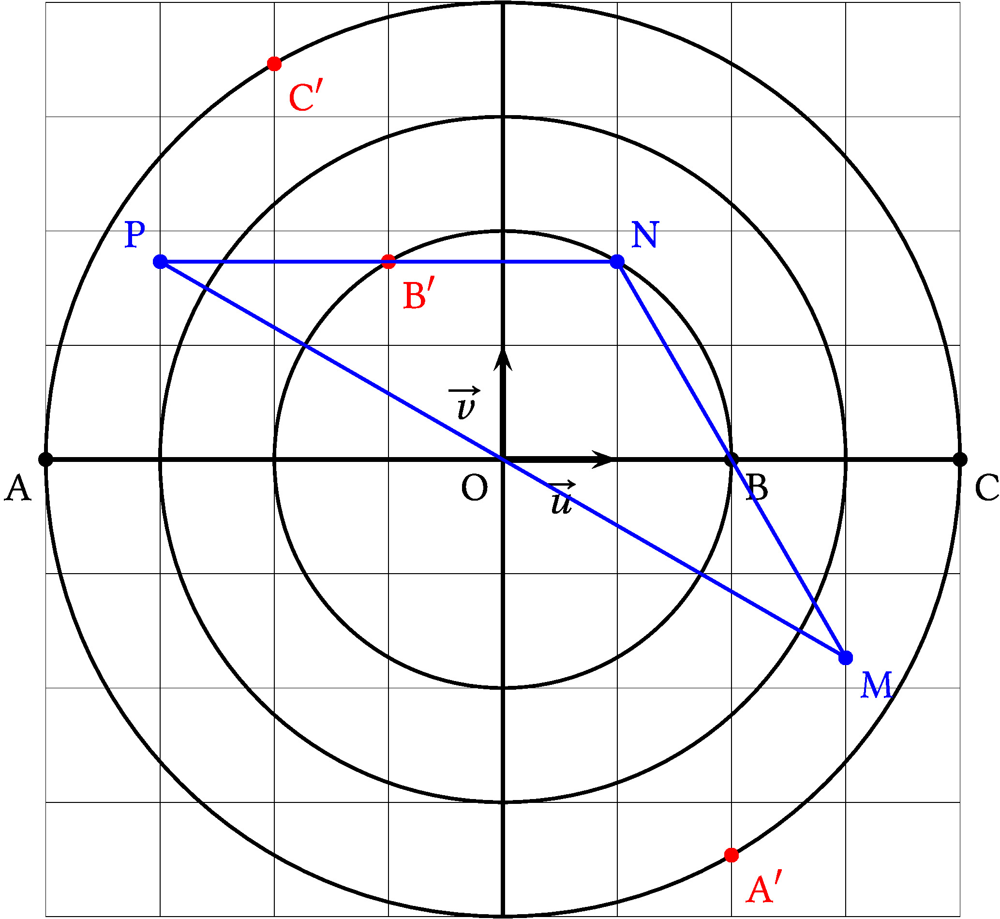
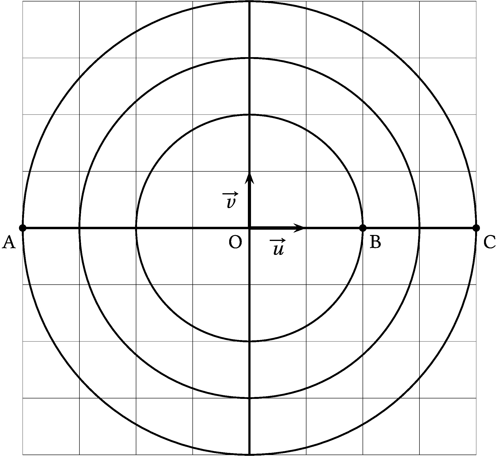
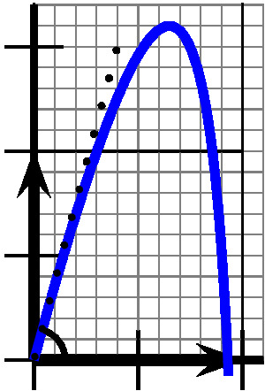
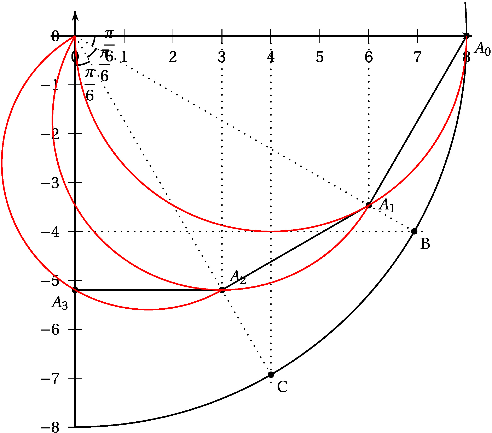

:::exercice Exercice 1: Les complexes sont nos amis 5.5 points

Le plan est muni d'un repère orthonormé
$\left(\text{O};~\overrightarrow{u},~\overrightarrow{v}\right)$.

Les points A, B et C ont pour affixes respectives $a = - 4,\: b = 2$ et
$c = 4$.

1\. On considère les trois points A$'$, B$'$ et C$'$ d'affixes
respectives $a'= \text{j}a$, $b'= \text{j}b$ et $c'= \text{j}c$ où j est
le nombre complexe:

$$j=-\dfrac{1}{2} + \text{i}\dfrac{\sqrt{3}}{2}$$

1\. a) Donner la forme trigonométrique et la forme exponentielle de j.

<ClientOnly><Solution>

$\text{j}=-\dfrac{1}{2} + \text{i}\dfrac{\sqrt{3}}{2}=\cos\left(\dfrac{2\pi}{3}\right) + \text{i}\sin\left(\dfrac{2\pi}{3}\right)=e^{\frac{2\text{i}\pi}{3}}$

$a'=a\text{j}=-4\text{j}=2-2\text{i}\sqrt{3}=4\left( -e^{\frac{2\text{i}\pi}{3}}\right)=4\left( e^{\text{i}\pi}{\frac{2\text{i}\pi}{3}}\right)=4e^{\text{i}\left( \pi+\frac{2\pi}{3}\right)  }=4e^{\frac{5\text{i}\pi}{3}}=4e^{-\frac{\text{i}\pi}{3}}$

$b'= b\text{j}=2\text{j}=-1+\text{i}\sqrt{3}=2e^{\frac{2\text{i}\pi}{3}}$

$c'= c\text{j}=4\text{j}=-2+2\text{i}\sqrt{3}=4e^{\frac{2\text{i}\pi}{3}}$

</Solution>

En déduire les formes algébriques et exponentielles de $a'$, $b'$ et
$c'$.

1\. b) Les points A, B et C ainsi que les cercles de centre O et de
rayon 2, 3 et 4 sont représentés sur le graphique ci-dessous.

Placer les points A$'$, B$'$ et C$'$ sur ce graphique.

<ClientOnly><Solution>

$|a'|=4$ donc A$'$ est sur le cercle de centre O et de rayon 4 et on a
$Re\left(a' \right) =2$ et $Im\left(a' \right)<0$, on peut donc placer
A$'$

$|b'|=2$ donc B$'$ est sur le cercle de centre O et de rayon 2 et on a
$Re\left(b' \right) =-1$ et $Im\left(b' \right)>0$, on peut donc placer
B$'$

$|c'|=4$ donc C$'$ est sur le cercle de centre O et de rayon 4 et on a
$Re\left(c' \right) =-2$ et $Im\left(c' \right)>0$, on peut donc placer
C$'$

</Solution>

2\. Montrer que les points A$'$, B$'$ et C$'$ sont alignés.

<ClientOnly><Solution>

$a'=-c'$ donc A$'$ et C$'$ sont symétriques par rapport à O alors O,
A$'$ et C$'$ sont alignés

$arg\left( b'\right) =arg\left( c'\right) =\dfrac{2\pi}{3} (2\pi)$

donc $\overrightarrow{\text{OB}'}$ et $\overrightarrow{\text{OC}'}$ sont
colinéaires d'où O, B$'$ et C$'$ sont alignés.

Finalement O, A$'$, B$'$ et C$'$ sont alignés.

</Solution>

3\. On note M le milieu du segment \[A$'$C\], N le milieu du segment
\[C$'$C\] et P le milieu du segment \[C$'$A\].

Démontrer que le triangle MNP est isocèle.

<ClientOnly><Solution>

$z_{\text{M}}=\dfrac{a'+c}{2}=3-\text{i}\sqrt{3}$

$z_{\text{N}}=\dfrac{c'+c}{2}=1+\text{i}\sqrt{3}$

$z_{\text{P}}=\dfrac{c'+a}{2}=-3+\text{i}\sqrt{3}$

MNP semble isocèle en N d'après le dessin

MN=$\left|z_{\text{N}}-z_{\text{M}} \right| = \left|2-2\text{i}\sqrt{3} \right| =4$

et

PN=$\left|z_{\text{N}}-z_{\text{P}} \right| =\left|4 \right| = 4$

On a MN=NP donc MNP est bien isocèle en N

</Solution>

**Graphique à compléter**

:::

:::exercice Exercice 2: Un peu de physique, mais pas trop\... 10 points

Lors d'une expérience en laboratoire, on lance un projectile dans un
milieu fluide. L'objectif est de déterminer pour quel angle de tir
$\theta$ par rapport à l'horizontale la hauteur du projectile ne dépasse
pas $1,6$ mètre.

Comme le projectile ne se déplace pas dans l'air mais dans un fluide, le
modèle parabolique usuel n'est pas adopté.

On modélise ici le projectile par un point qui se déplace, dans un plan
vertical, sur la courbe représentative de la fonction $f$ définie sur
l'intervalle \[0 ; 1\[ par:

$$f(x) = bx + 2\ln (1- x)$$

où $b$ est un paramètre réel supérieur ou égal à $2$, $x$ est l'abscisse
du projectile, $f(x)$ son ordonnée, toutes les deux exprimées en mètres.

1\. La fonction $f$ est dérivable sur l'intervalle \[0 ; 1\[. On note
$f'$ sa fonction dérivée.

1\. a) Démontrer que, pour tout réel $x$ de l'intervalle \[0 ; 1\[ :

$$f'(x) = \dfrac{- bx + b - 2}{1 - x}.$$

<ClientOnly><Solution>

On va utiliser: $\left(\ln (u) \right) ' = \frac{u'}{u}$

$f'(x) = b + 2\times \frac{-1}{1-x} = \cdots = \frac{-bx+x-2}{1-x}$

</Solution>

1\. b) Démontrer que fonction $f$ possède un maximum sur l'intervalle
\[0 ; 1\[ et que,

le maximum de la fonction $f$ est égal à
$b - 2 + 2\ln \left(\dfrac{2}{b}\right)$.

<ClientOnly><Solution>

Puisque la fonction $f$ est dérivable, et que l'on connaît sa fonction
dérivée, on va étudier le signe de la fonction dérivée pour connaître
les variations de la fonction $f$.

Soit $x$ dans $[0~;~1[$. On a $x < 1$ et donc, $0< 1  -x$.

Le dénominateur de $f'(x)$ étant strictement positif, le signe de
$f'(x)$ est le signe du numérateur, qui est une quantité affine, de
coefficient directeur $- b$ négatif (puisque $b$ est supérieur à 2) et
donc on aura bien une fonction dérivée d'abord positive, pour
$x \leqslant \dfrac{b - 2}{b}$, puis négative.

On remarque le nombre $\dfrac{b-2}{b} = 1 - \dfrac{2}{b}$ est un nombre
inférieur à 1 et positif, car $b$ est un réel positif, supérieur à 2.

On peut donc affirmer que la fonction $f$ est croissante sur
l'intervalle $\left[0~;~\dfrac{b - 2}{b}\right]$ et décroissante sur
$\left[\dfrac{b - 2}{b}~;~1\right[$.

Ces variations indiquent que $f$ atteint un maximum pour
$x = \dfrac{b - 2}{b} = 1 - \dfrac{2}{b}$.

Ce maximum est donc
$f\left(1 - \dfrac{2}{b}\right) = b\times \left(1 - \dfrac{2}{b}\right) + 2\ln\left(1 - \left(1 - \dfrac{2}{b} \right) \right) = b - 2 + 2 \ln\left(\dfrac{2}{b}\right)$.

Le maximum de la fonction $f$ s'établit bien à
$b - 2 + 2 \ln\left(\dfrac{2}{b}\right)$.

</Solution>

2\. On cherche à déterminer pour quelles valeurs du paramètre $b$ la
hauteur maximale du projectile ne dépasse pas $1,6$ mètre.

Si on essaye de résoudre l'inéquation
$b - 2 + 2 \ln\left(\dfrac{2}{b}\right) \leqslant 1,6$, on se retrouve
devant une équation que l'on ne sait pas résoudre de façon exacte.

Posons $m$ la fonction définie sur $[2~;~+\infty[$ par
$m(b) = b - 2 + 2 \ln\left(\dfrac{2}{b}\right) = b - 2 + \ln(4) - 2\ln(b)$.

2\. a) Etudier les variations de la fonction $m$ pour $b$ supérieur à 2.

<ClientOnly><Solution>

La fonction $m$ est dérivable sur son ensemble de définition et on a
pour tout $b$ supérieur à 2 :

$m'(b) = 1 - \dfrac{2}{b}$.

Comme $b$ est supérieur à 2, on en déduit que $m'(b)$ est positif, et
même strictement positif pour $b>2$, et donc que la fonction $m$ est
strictement croissante sur $[2~;~+\infty[$.

</Solution>

2\. b) Déterminer: $\lim_{b \to +\infty} m(b)$

<ClientOnly><Solution>

TODO

</Solution>

2\. c) Dresser le tableau de variation de $m$ sur $[2;+\infty[$

<ClientOnly><Solution>

TODO

</Solution>

2\. d) Démontrer que l'équation $m(b)=1,6$ admet une unique solution
$b_0$ dans $[2;10]$. En donner un encadrement à $0,01$ près.

<ClientOnly><Solution>

La fonction $m$ étant continue (car dérivable) et strictement croissante
sur l'intervalle $[2~;~10]$ et 1,6 étant une valeur intermédiaire entre
$m(0) = 0$ et $m(10) \approx 4,8$, le corollaire au théorème des valeurs
intermédiaires permet d'affirmer qu'il existe un unique nombre $b_0$
antécédent de 1,6 par $m$ sur $[2~;~10]$. Comme $m$ est strictement
croissante sur $[2~;~+\infty[$, il n'y aura pas d'autre antécédent que
celui là.

Un balayage à la calculatrice donne $5,69 < b_0 < 5,70$.

</Solution>

2\. e) Conclure.

<ClientOnly><Solution>

Les valeurs du paramètre $b$ garantissant une hauteur maximale $m(b)$ ne
dépassant pas 1,6 mètre sont donc les réels de l'intervalle $[2~;~b_0]$,
soit, en donnant une valeur approchée (nécessairement par défaut, vu que
$m$ est croissante) de l'intervalle $[2~;~5,69]$.

</Solution>

3\. Dans cette question, on choisit $b = 5,69$.

L'angle de tir $\theta$ correspond à l'angle entre l'axe des abscisses
et la tangente à la courbe de la fonction $f$ au point d'abscisse $0$
comme indiqué sur le schéma donné ci-dessus.

Déterminer une valeur approchée au dixième de degré près de l'angle
$\theta$.

<ClientOnly><Solution>

Si on choisit $b = 5,69$, alors, cela signifie que la tangente tracée en
pointillés est la droite d'équation :

$$y = f'(0) \times (x - 0) + f(0) = \dfrac{b - 2}{1 - 0} \times x + 0 = (5,69 - 2)x = 3,69x$$

Cela signifie que l'origine du repère, le point de coordonnée $(1~;~0)$
et le point de coordonnées $(1~;~3,69)$ forment un triangle rectangle,
dans lequel le côté opposé à l'angle $\theta$ mesure 3,69 et le côté
adjacent mesure $1$, donc la tangente de l'angle est donnée par
$\tan \theta = \dfrac{3,69}{1} = 3,69$.

À la calculatrice (réglée en mode degrés), on obtient
$\theta = \arctan(3,69) \approx 74,8$ degrés

</Solution>

:::

:::exercice Exercice 3: VRAI-FAUX 4 points

Pour chacune des affirmations suivantes, indiquer si elle est vraie ou
fausse, en justifiant la réponse. Il est attribué deux points par
réponse exacte correctement justifiée.

1\. On considère dans $\R$ l'équation :

$$\ln (6 x - 2) + \ln (2x - 1) = \ln (x).$$

**Affirmation** l'équation admet deux solutions dans l'intervalle
$\left]\dfrac{1}{2}~;~+ \infty\right[$.

<ClientOnly><Solution>

$\bullet$ Soit $I=\left]\frac{1}{2}~;~+ \infty\right[$.

$\bullet$ $\ln\left (6x-2\right )$ n'existe que si $6x-2>0$,
c'est-à-dire $x>\dfrac{1}{3}$; donc $\ln\left (6x-2\right )$ existe si
$x\in I$.

$\bullet$ $\ln\left (2x-1\right )$ n'existe que si $2x-1>0$,
c'est-à-dire $x>\dfrac{1}{2}$; donc $\ln\left (2x-1\right )$ existe si
$x\in I$.

$\bullet$ $\ln\left (x\right )$ n'existe que si $x>0$; donc
$\ln\left (x\right )$ existe si $x\in I$.

2\. Sur l'intervalle $I$:

$\ln (6 x - 2) + \ln (2x - 1) = \ln (x)
\iff \ln \left ((6 x - 2)(2x - 1)\strut\right ) = \ln (x)
\iff  (6 x - 2)(2x - 1) = x \newline
\iff 12x^2 - 4x - 6x + 2 = x
\iff 12x^2 -11x +2=0$

3\. On résout dans $I$ l'équation $12x^2 -11x +2=0$.

$\Delta = 11^2 - 4\times 12\times 2 = 25 = 5^2$;
$x'=\dfrac{11+5}{2\times 12} = \dfrac{16}{24}=\dfrac{2}{3}$ et
$x''=\dfrac{11-5}{24}=\dfrac{6}{24}= \dfrac{1}{4}$

$x'\in I$ et $x'' \not\in I$ donc l'équation du départ n'admet qu'une
solution dans l'intervalle $I$.

**L'affirmation est fausse.**

</Solution>

4\. On considère dans l'équation :

$$\left(4z^2 - 20z + 37\right)(2z -7 + 2\text{i}) = 0.$$

**Affirmation** les solutions de l'équation sont les affixes de points
appartenant à un même cercle de centre le point P d'affixe $2$.

<ClientOnly><Solution>

$\bullet$ Les solutions de l'équation
$\left(4z^2 - 20z + 37\right)(2z -7 + 2i) = 0$ sont les solutions des
deux équations $4z^2 - 20z + 37 = 0$ et $2z -7 + 2i = 0$.

$\bullet$ On résout dans l'équation $4z^2 - 20z + 37 = 0$.

$\Delta=20^2 - 4\times 4\times 37 = -192<0$; l'équation admet donc deux
solutions complexes conjuguées:
$z_1 = \dfrac{20 + i \sqrt{192}}{2\times 4} = \dfrac{20 + 8i \sqrt{3}}{8} = \dfrac{5}{2}+i\sqrt{3}$
et $z_2 = \dfrac{5}{2} - i\sqrt{3}$

$\bullet$ On résout dans l'équation $2z-7+2i=0$:
$2z-7+2i=0 \iff 2z=7-2i \iff z = \dfrac{7}{2} - i$

Cette équation a pour solution le nombre complexe $z_3=\dfrac{7}{2}- i$.

$\bullet$ On appelle A, B et C les points d'affixes respectives $z_1$,
$z_2$ et $z_3$.

$\bullet$
$\mathrm{PA} = \left |  z_1 - z_{\mathrm{P}} \right | = \left | \dfrac{5}{2} + i\sqrt{3} -2 \right | = \left |  \dfrac{1}{2} +i\sqrt{3} \right | = \displaystyle\sqrt{\dfrac{1}{4} + 3} = \sqrt{\dfrac{13}{4}}$

$\bullet$
$\mathrm{PB} = \left |z_2 - z_{\mathrm{P}} \right | = \left |\dfrac{5}{2} - i\sqrt{3}-2 \right | = \left |  \dfrac{1}{2} - i\sqrt{3} \right | = \sqrt{\dfrac{1}{4} + 3} = \sqrt{\dfrac{13}{4}}$

$\bullet$
$\mathrm{PC} = \left | z_3 - z_{\mathrm{P}} \right | = \left |\dfrac{7}{2} - i -2 \right | = \left | \dfrac{3}{2} - i \right | = \sqrt{\dfrac{9}{4} + 1} = \sqrt{\dfrac{13}{4}}$

5\. $\mathrm{PA} = \mathrm{PB} = \mathrm{PC}$ donc les solutions de
l'équation sont les affixes de trois points situés sur le cercle de
centre P d'affixe 2 et de rayon $\dfrac{13}{4}$.

**L'affirmation est vraie.**

</Solution>

:::

:::exercice Exercice 4: Complexes: suites\... 10.5 points

Le plan complexe est muni d'un repère orthonormé direct
$\left(\text{O};~\overrightarrow{u},~\overrightarrow{v}\right)$.

On pose $z_0 = 8$ et, pour tout entier naturel $n$ :

$$z_{n+1} = \dfrac{3 - \text{i}\sqrt{3}}{4}z_n.$$

On note $A_n$ le point du plan d'affixe $z_n$.

1\.

1\. a) Vérifier que :

$$\dfrac{3 - \text{i}\sqrt{3}}{4} = \dfrac{\sqrt{3}}{2}\text{e}^{- \text{i}\frac{\pi}{6}}.$$

<ClientOnly><Solution>

$\dfrac{\sqrt{3}}{2} \text{e}^{-\text{i} \frac{\pi}{6}} = \dfrac{\sqrt{3}}{2} \left( \cos\left(-\dfrac{\pi}{6}\right) + \text{i}\sin\left(-\dfrac{\pi}{6}\right) \right) = \dfrac{\sqrt{3}}{2} \left( \dfrac{\sqrt{3}}{2} - \text{i}\dfrac{1}{2} \right) = \dfrac{3}{4} - \text{i} \dfrac{\sqrt{3}}{4} = \dfrac{3-\text{i}\sqrt{3}}{4}$

</Solution>

1\. b) En déduire l'écriture de chacun des nombres complexes $z_1$,
$z_2$ et $z_3$ sous forme exponentielle et vérifier que $z_3$ est un
imaginaire pur dont on précisera la partie imaginaire.

<ClientOnly><Solution>

$z_1=\dfrac{\sqrt{3}}{2} \text{e}^{-\text{i} \frac{\pi}{6}}z_0=\dfrac{\sqrt{3}}{2} \text{e}^{-\text{i} \frac{\pi}{6}} \times 8$
donc $\boxed{ z_1=4\sqrt{3} \text{e}^{-\text{i} \frac{\pi}{6}} }$

$z_2=\dfrac{\sqrt{3}}{2} \text{e}^{-\text{i} \frac{\pi}{6}}z_1 = \dfrac{\sqrt{3}}{2} \text{e}^{-\text{i} \frac{\pi}{6}} \times 4\sqrt{3} \text{e}^{-\text{i} \frac{\pi}{6}} = 6 \text{e}^{-\text{i} \frac{2\pi}{6}}$
donc $\boxed{ z_2=6 \text{e}^{-\text{i} \frac{\pi}{3}} }$

$z_3=\dfrac{\sqrt{3}}{2} \text{e}^{-\text{i} \frac{\pi}{6}}z_2 = \dfrac{\sqrt{3}}{2} \text{e}^{-\text{i} \frac{\pi}{6}} \times 6 \text{e}^{-\text{i} \frac{\pi}{3}} = 3\sqrt{3} \text{e}^{-\text{i} \frac{3\pi}{6}}$
donc $\boxed{ z_3=3\sqrt{3} \text{e}^{-\text{i} \frac{\pi}{2}} }$

$\arg(z_3) = \dfrac{-\pi}{2}$ donc $z_3$ est un imaginaire pur dont la
partie imaginaire est négative et

$\boxed{ \text{Im}\left(z_3\right) = - 3\sqrt{3} }$

</Solution>

1\. c) Représenter graphiquement les points $A_0$ , $A_1$ , $A_2$ et
$A_3$ ; on prendra pour unité le centimètre.

<ClientOnly><Solution>

[Figure représentation des points $A_0$, $A_1$, $A_2$,
$A_3$]{.smallcaps}

La relation
$z_{n+1} = \dfrac{\sqrt{3}}{2}\text{e}^{- \text{i}\frac{\pi}{6}}z_n$
montre en prenant les arguments que

arg$\left(z_{n+1} \right) = \text{arg}\left(\dfrac{\sqrt{3}}{2}\text{e}^{- \text{i}\frac{\pi}{6}}\right) + \text{arg}\left(z_n\right)$.
Or
$\text{arg}\left(\dfrac{\sqrt{3}}{2}\text{e}^{- \text{i}\frac{\pi}{6}} \right) = - \dfrac{\pi}{6}$.

On a donc pour tout $n \in \N$,
$\left(\overrightarrow{\text{O}A_n},~\overrightarrow{\text{O}A_{n+1}} \right) = - \dfrac{\pi}{6}$.

On a donc
$\left(\overrightarrow{\text{O}A_0},~\overrightarrow{\text{O}A_{1}} \right) = - \dfrac{\pi}{6}$,
puis
$\left(\overrightarrow{\text{O}A_0},~\overrightarrow{\text{O}A_{2}} \right) = - \dfrac{\pi}{3}$
et
$\left(\overrightarrow{\text{O}A_0},~\overrightarrow{\text{O}A_{3}} \right) = - \dfrac{\pi}{2}$.

$\bullet~~$$A_0$ a pour affixe 8 ;

$\bullet~~$ On sait que $\sin - \frac{\pi}{6} = - \frac{1}{2}$. On trace
donc l'horizontale partant du point de coordonnées $(0~;~- 4)$ qui coupe
le cercle de centre O de rayon 8 en un point B d'abscisse positive. La
droite verticale d'équation $x = 6$ coupe OB en $A_1$.

$\bullet~~$ On sait que $\cos - \frac{\pi}{3} =  \frac{1}{2}$. On trace
donc la verticale ale partant du point de coordonnées $(4~;~0)$ qui
coupe le cercle de centre O de rayon 8 en un point C d'ordonnée
négative. La droite verticale d'équation $x = 3$ coupe OC en $A_2$.

$\bullet~~$ Enfin $A_3$ est le projeté orthogonal de $A_2$ sur l'axe des
ordonnées puisque $\text{O}A_3 = \dfrac{\sqrt{3}}{2}\text{O}A_2$ ou
encore $\text{O}A_3 = \cos \frac{\pi}{6}\text{O}A_2$.

*Remarque* :

Puisque que pour tout naturel $n$,
O$A_{n+1} = \cos \frac{\pi}{6} \text{O}A_n$, le point $A_{n+}$ est la
projeté orthogonal de $A_n$ sur la droite O$A_{n+1}$.

$A_1$ est donc le point d'intersection de la droite (OB) avec le
demi-cercle de diamètre $\left[\text{O}A_0\right]$ contenant les points
d'ordonnée négative.

$A_2$ est le point d'intersection de la droite (OC) avec le demi-cercle
de diamètre $\left[\text{O}A_1\right]$. (voir les demi-cercles tracés en
rouge)

$A_3$ est le point d'intersection de l'axe des ordonnées avec le
demi-cercle de diamètre $\left[\text{O}A_2\right]$.

</Solution>

2\.

2\. a) Démontrer par récurrence que, pour tout entier naturel $n$,

$$z_n = 8 \times \left(\dfrac{\sqrt{3}}{2}\right)^n \text{e}^{- \text{i}\frac{n\pi}{6}}.$$

<ClientOnly><Solution>

*Initialisation* $z_0 = 8 \times 1 \times 1 = 8$ donc la propriété est
vraie pour $n=0$.

*Hérédité* : On suppose que pour $n \geqslant 0$,
$z_n=8 \times \left( \dfrac{\sqrt{3}}{2} \right)^n \text{e}^{-\text{i} \frac{n\pi}{6}}$
et on va montrer que

$z_{n+1} = 8 \times \left( \dfrac{\sqrt{3}}{2} \right)^{n+1} \text{e}^{-\text{i} \frac{(n+1)\pi}{6}}$

On a
$z_{n+1}= \dfrac{\sqrt{3}}{2} z_n= \dfrac{\sqrt{3}}{2}\text{e}^{-\text{i} \frac{\pi}{6}} \times 8\times \left( \dfrac{\sqrt{3}}{2} \right)^n \text{e}^{-\text{i} \frac{n\pi}{6}}$
*(par hypothèse de récurrence)*.

Donc
$z_{n+1}=8 \times \left( \dfrac{\sqrt{3}}{2} \right)^{n+1} \text{e}^{-\text{i} \frac{(n+1)\pi}{6}}$
*(en utilisant la propriété $a^n \times a = a^{n+1}$ pour tout nombre
réel $a$)* .

Donc la propriété est héréditaire.

La propriété est vraie au rang $0$, et si elle est vraie au rang
$n \geqslant 0$, elle l'est aussi au rang $n + 1$

Conclusion : d'après le principe de récurrence la propriété est vraie
pour tout entier naturel $n$.

</Solution>

2\. b) Pour tout entier naturel $n$, on pose $u_n = \left|z_n\right|$.

Déterminer la nature et la limite de la suite $\left(u_n\right)$.

<ClientOnly><Solution>

On a donc
$u_n=\left|z_n\right| =8 \times \left( \dfrac{\sqrt{3}}{2} \right)^n$

Il s'agit d'une suite géométrique de premier terme $u_0=8$ et de raison
$\dfrac{\sqrt{3}}{2}$.

$0 < \dfrac{\sqrt{3}}{2} < 1$ donc
$\displaystyle\lim_{n \to + \infty} \left( \dfrac{\sqrt{3}}{2} \right)^n = 0$
puis $\boxed{ \displaystyle\lim_{n \to + \infty} u_n = 8 \times 0 = 0 }$

</Solution>

3\.

3\. a) Démontrer que, pour tout entier naturel $k$,

$$\dfrac{z_{k+1} - z_{k}}{z_{k+1}} = - \dfrac{1}{\sqrt{3}}\text{i}.$$

En déduire que, pour tout entier naturel $k$, on a l'égalité :
$A_kA_{k+1} = \dfrac{1}{\sqrt{3}} \text{O}A_{k+1}$.

<ClientOnly><Solution>

$\dfrac{z_{k+1} - z_k}{z_{k+1} } = \dfrac{ \dfrac{3-\text{i}\sqrt{3}}{4}z_k - z_k}{ \dfrac{3-\text{i}\sqrt{3}}{4}z_k } = \dfrac{ \cancel{z_k} \left( \dfrac{3-\text{i}\sqrt{3}}{4} - 1 \right)}{ \dfrac{3-\text{i}\sqrt{3}}{4}\cancel{z_k} }
=\dfrac{ \dfrac{3-\text{i}\sqrt{3}}{4} - 1 }{\dfrac{3-\text{i}\sqrt{3}}{4}}
= \dfrac{ -1-\text{i}\sqrt{3} }{4} \times \dfrac{4}{3-\text{i}\sqrt{3}}
= \dfrac{ -1-\text{i}\sqrt{3} }{3-\text{i}\sqrt{3}}$

On multiplie par le conjugué du dénominateur :

$\dfrac{z_{k+1} - z_k}{z_{k+1}}
=\dfrac{ (-1-\text{i}\sqrt{3})(3+\text{i}\sqrt{3}) }{ (3-\text{i}\sqrt{3})(3+\text{i}\sqrt{3})}
= \dfrac{-3-\text{i}\sqrt{3}-3\text{i}\sqrt{3}+3 }{9+3} = \dfrac{-4\text{i}\sqrt{3}\times \sqrt{3} }{12 \times \sqrt{3} } = \dfrac{-12\text{i}}{12\sqrt{3}} = - \dfrac{1}{\sqrt{3}} \text{i}$

On a donc
$\left|\dfrac{z_{k+1} - z_k}{z_{k+1} }\right| = \left|- \dfrac{1}{\sqrt{3}} \text{i}\right|
\iff \dfrac{\left|z_{k+1} - z_k \right|}{\left|z_{k+1} \right|} = \dfrac{1}{\sqrt{3}}
\iff \dfrac{A_kA_{k+1}}{OA_{k+1}} = \dfrac{1}{\sqrt{3}}
\iff$

$A_kA_{k+1} = \dfrac{1}{\sqrt{3}} OA_{k+1}$.

</Solution>

3\. b) Pour tout entier naturel $n$, on appelle $\ell_n$ la longueur de
la ligne brisée reliant dans cet ordre les points $A_0$, $A_1$, $A_2$,
..., $A_n$.

On a ainsi : $\ell_n = A_0A_1 + A_1A_2 + \ldots + A_{n-1}A_n$.

Démontrer que la suite $\left(\ell_n\right)$ est convergente et calculer
sa limite.

<ClientOnly><Solution>

D'après la question précédente, pour tout entier naturel $k$,

$A_kA_{k+1} = \dfrac{1}{\sqrt{3}} OA_{k+1} = \dfrac{1}{\sqrt{3}} \left|z_{k+1} \right| = \dfrac{1}{\sqrt{3}} \times 8 \times \left( \dfrac{\sqrt{3}}{2} \right)^{k+1} = \dfrac{8}{\sqrt{3}} \left( \dfrac{\sqrt{3}}{2} \right)^{k+1}$

Donc
$\ell_n=\dfrac{8}{\sqrt{3}} \left( \dfrac{\sqrt{3}}{2} \right)^1 + \dfrac{8}{\sqrt{3}} \left( \dfrac{\sqrt{3}}{2} \right)^2 + \cdots + \dfrac{8}{\sqrt{3}} \left( \dfrac{\sqrt{3}}{2} \right)^n
= \dfrac{8}{\sqrt{3}} \times \dfrac{\sqrt{3}}{2} \left( 1 +  \left( \dfrac{\sqrt{3}}{2} \right)^1 + \cdots + \left( \dfrac{\sqrt{3}}{2} \right)^{n-1} \right)$

Puis
$\ell_n=4 \times \dfrac{1 - \left( \dfrac{\sqrt{3}}{2} \right)^{n} }{1-\left( \dfrac{\sqrt{3}}{2} \right)}
=4 \times \dfrac{1 - \left( \dfrac{\sqrt{3}}{2} \right)^{n} }{\dfrac{2-\sqrt{3}}{2}}
=\dfrac{8}{2-\sqrt{3}} \times \left( 1 - \left( \dfrac{\sqrt{3}}{2} \right)^{n} \right)$

Pour finir,
$\displaystyle\lim_{n \to + \infty} \ell_n=\dfrac{8}{2-\sqrt{3}}(1-0) =\dfrac{8}{2-\sqrt{3}} \approx 29,86$

</Solution>

:::