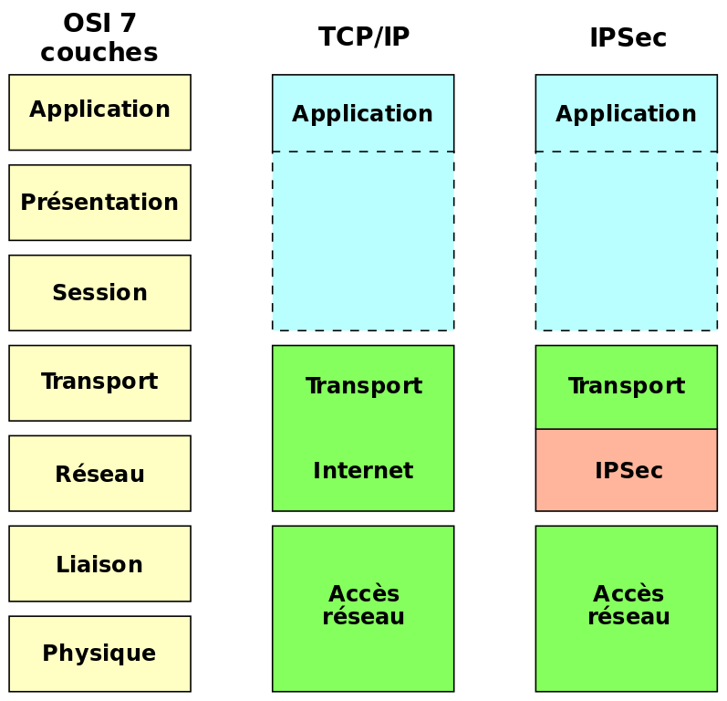

## Repères historiques

+ 1958: Premières communications entre deux ordinateurs avec un modem (laboratoires Bell, USA)
+ 1962: Recherches pour créer un réseau global d'ordinateurs indépendant des constructeurs
+ 1969: Naissance d' **ARPANET** (*Advanced Researsh Projects Agency Network*)
+ 1973: 23 ordinateurs connectés à ARPANet. Naissance du **projet Cyclades** en France.
+ 1983: Naissance officielle d'Internet, d'Ethernet et des protocoles TCP/IP
+ 1992: un million d'ordinateurs connectés à Internet.
+ 1995: Recherches pour mettre en place IPv6 en vue de la pénurie d'adresses IPv4
+ 1997: Apparition du Wi-Fi
+ 2012: La **4G** généralise l'accès à l'Internet mobile en France.
+ 2019: Plus de 1,5 milliards de sites Internet recencés dans le monde

Issu de recherches datant des années 1950 et apparu dans les années 1980, Internet est désormais le réseau public mondial d'échange de toutes formes d'informations numérisées.

## Internet et les réseaux physiques

Internet est un réseau logiciel mondial qui repose en réalité sur une grande variété d'infrastures
physiques (câbles, antennes et relais, satellites, fibres) par le biais
desquelles les données transitent.

### Les câbles sous-marins d'Internet

D'un seul câble transatlantique en 1858 et d'une vingtaine en 2015, on passe à plus de 
450 câbles sous-marins aujourd'hui qui s'étendent sur plur de 1,2 millions de kilomètres,
reposant au fond des océeans.

Ces liaisons à fibres optiques supportent plus de 99 % du trafic internet mondial.
Leur nombre augmente chaque année pour faire face à l'augmentation considérable du flux de données.

[Carte interactive](https://www.submarinecablemap.com/)

Données statistiques:

 Vous trouverez plus d'infographie sur <a href="https://fr.statista.com/graphique-du-jour/">Statista</a>

:::tip Vidéo
Vidéo qui date de 2017, mais est toujours dans l'ensemble d'actualité: [Câbles sous-marins, la guerre invisible](https://www.youtube.com/watch?v=Cb7ibgRivwU)
:::

:::warning Info
L'ennemi numéro un des câbles sous-marins ne sont pas les avalanches sous-marines,
ni même les morsures de requins, mais d'abord et de loin les ancres de bateaux.
:::

## Distribution du trafic Internet mondial en 2019

 Vous trouverez plus d'infographie sur <a href="https://fr.statista.com/graphique-du-jour/">Statista</a>

 Vous trouverez plus d'infographie sur <a href="https://fr.statista.com/graphique-du-jour/">Statista</a>

## Le protocole TCP/IP

Grâce à son universalité, Internet est devenu le moyen de communication principal entre les hommes et les machines.
Pour communiquer, tous les appareils connectés utilisent des règles communes constituant un protocole de communication.

### Le protocole IP

Tous les objets connectés à Internet (tablettes, smartphones, etc...) peuvent échanger entre eux des informations respectant un certain protocole. C'est le **protocole IP** (*Internet Protocol*)

A chaque appareil est associé un numéro d'indentification. c'est **l'adresse IP**.

C'est une adresse unique attribuée à chaque appareil connecté sur internet: c'est-à-dire qu'il n'existe pas sur internet deux ordinateurs ayant la même adresse IP. 

+ Les adresses **IPv4**  se présentent le plus souvent sous forme de quatre nombres (entre 0 et 255), séparés par des points.

Par exemple: 204.35.129.3

+ Les adresses **IPv6** sont codées en hexadécimal sur 16 octects (8 parties telles que chaque partie est sur 2 octets).

Par exemple: 3ac4:0567:0000:34b6:0000:0000:c6d4:43000

+ Pour connaitre votre address IP: [my-ip-finder](https://www.my-ip-finder.fr/)
+ Ce site permet aussi de trouver l'adresse IP d'un domaine quelconque.

:::tip A retenir
Le **protocole IP** (Internet Protocol) donne une adresse à toutes les machines du réseau. 
Ses principales fonctions sont:
+ de définir le format des données 
+ d'assurer l'adressage et le routage de ces paquets jusqu'à leur adresse de destination
+ de fragmenter et réassembler les paquets si nécessaire.
:::

### Le protocole TCP

**TCP** (*Transmission Control Protocol): littéralement "le procotole de contrôle de transmission".

Il régit les échanges de paquets de données entre des machines connectées sur Internet.
+ Il vérifie que le destinataire est prêt à recevoir les données dans les bonnes conditions.
+ Il prépare les envois de paquets de données.L'émetteur découpe les gros paquets de données en paquets plus petits.
+ Il vérifie que chaque paquet est bien arrivé. Au besoin, le TCP du destinataire remande les paquets manquants et les réassemble avant de les livrer dans la machine.

TCP ne garantit pas un delai précis. La durée d'envoie d'un paquet dépend des débits disponibles à l'instant du transfert.

### TCP/IP, le modèle en couches

+ COUCHE APPLICATION: Englobe les applications standard du réseau (le logiciels présents sur une machine connectée) et l'indication du protocole de transport utilisé.
+ COUCHE TRANSPORT (TCP): Fragmente les messages en paquets de données afin de pouvoir les acheminer sur la couche Internet d'une machine à une autre adresse IP et établit la communication entre les deux adresses.
+ COUCHE INTERNET (IP): Détermine les chemins possibles à travers le réseau en précisant notament les adresses IP de l'expéditeur et du destinaire.
+ COUCHE ACCES RESEAU: Spécifie la forme sous laquelle les données doivent être acheminées quel que soit le type de réseau utilisé.

source: [wikipedia.fr](https://fr.m.wikipedia.org/wiki/Fichier:Internetprotocolsecurity-fr.svg)

  

