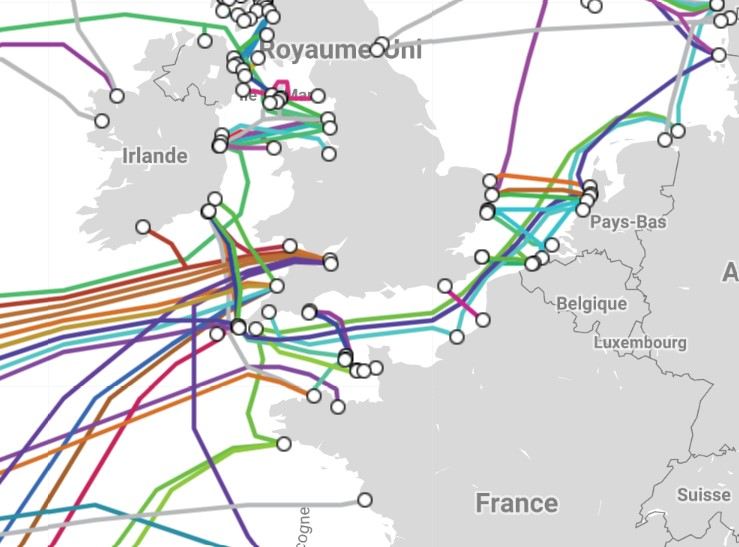

## Internet et les réseaux physiques

Internet est un réseau logiciel mondial qui repose en réalité sur une grande variété d'infrastures
physiques (câbles, antennes et relais, satellites, fibres) par le biais
desquelles les données transitent.

### Les câbles sous-marins d'Internet

D'un seul câble transatlantique en 1858 et d'une vingtaine en 2015, on passe à plus de 
450 câbles sous-marins aujourd'hui qui s'étendent sur plur de 1,2 millions de kilomètres,
reposant au fond des océeans.

Ces liaisons à fibres optiques supportent plus de 99 % du trafic internet mondial.
Leur nombre augmente chaque année pour faire face à l'augmentation considérable du flux de données.

[Carte interactive](https://www.submarinecablemap.com/)

Données statistiques:

 Vous trouverez plus d'infographie sur <a href="https://fr.statista.com/graphique-du-jour/">Statista</a>

Vidéo qui date de 2017, mais est toujours dans l'ensemble d'actualité: [Câbles sous-marins, la guerre invisible](https://www.youtube.com/watch?v=Cb7ibgRivwU)

<iframe width="560" height="315" src="https://www.youtube.com/watch?v=Cb7ibgRivwU" frameborder="0" allow="autoplay; encrypted-media" allowfullscreen></iframe>

:::warning Info
L'ennemi numéro un des câbles sous-marins ne sont pas les avalanches sous-marines,
ni même les morsures de requins, mais d'abord et de loin les ancres de bateaux.
:::

### Distribution du trafic Internet mondial en 2019

 Vous trouverez plus d'infographie sur <a href="https://fr.statista.com/graphique-du-jour/">Statista</a>

## Le protocole TCP/IP

Grâce à son universalité, Internet est devenu le moyen de communication principal entre les hommes et les machines.
Pour communiquer, tous les appareils connectés utilisent des règles communes constituant un protocole de communication.

### Le protocole IP

Tous les objets connectés à Internet (tablettes, smartphones, etc...) peuvent échanger entre eux des informations respectant un certain protocole. C'est le **protocole IP** (*Internet Protocol*)

A chaque appareil est associé un numéro d'indentification. c'est **l'adresse IP**.

C'est une adresse unique attribuée à chaque appareil connecté sur internet: c'est-à-dire qu'il n'existe pas sur internet deux ordinateurs ayant la même adresse IP. Elle se présente le plus souvent sous forme de quatre nombres (entre 0 et 255), séparés par des points.

Par exemple: 204.35.129.3

Pour connaitre votre address IP: [mon-ip](http://www.mon-ip.com/)

  

